# 노코드 자동화 워크플로우 설계 (B1-3)

동일한 자동화 워크플로우를 **Make**와 **n8n(셀프호스팅)** 두 도구로 구현해 비교 분석하고, 자유 주제 자동화 파이프라인을 설계·구현하는 미션이다.

---

## 0. 요구사항 충족 요약 및 핵심 개념

### 프로젝트 1 — 자동화 도구 비교 구현

| 요구사항 | 충족 | 근거 |
|---|---|---|
| 서로 다른 도구 2개 이상 사용 | ✅ | Make(클라우드), n8n 2.34.4(Docker 셀프호스팅) — §1.2, §1.3 |
| 동일한 워크플로우 구조로 구현 | ✅ | Trigger·분기 조건·Action 구성 동일 — §1.1 |
| **Trigger** 1개 이상 | ✅ | Webhook(HTTP POST 수신) — §1.1 |
| **Action** 2개 이상 | ✅ | 경로당 2개(Google Sheets 행 추가 + Discord 알림), 총 4개 — §1.1 |
| **조건 분기(Filter/Router)** 1개 이상 | ✅ | Make: Router + Filter / n8n: IF 노드 — §1.1, §1.5-6 |
| 분기 경로별 실제 실행 결과 | ✅ | 긴급 경로 §1.4-A / 일반 경로 §1.4-B (양 도구 각각 확보) |
| 워크플로우 구성 화면 캡처 | ✅ | Make §1.2 캡처 3 / n8n §1.3 캡처 9 |
| 실행 결과 화면 캡처 | ✅ | §1.4 캡처 10~16 (분기별 실행 + Action 결과) |
| 비교 항목 5개 이상 | ✅ | **9개 항목** — §1.5 |
| 도구별 장단점 정리 | ✅ | §1.6 |
| 상황별 적합성 의견 | ✅ | §1.6 |
| 무료 플랜 범위 / 유료 기능 사용 여부 | ✅ | 전 과정 무료 플랜 내 완수 — §1.7 |
| 민감정보 마스킹 | ✅ | §5 |

### 프로젝트 2 — 자유 주제 자동화

| 요구사항 | 충족 | 근거 |
|---|---|---|
| 자동화할 반복 업무 1개 정의 | ✅ | 고교야구 투구수 규정 점검 — §2.1 |
| 도구 선정 및 선정 이유 | ✅ | Make 선정, 프로젝트 1 실측 근거 — §2.2 |
| 워크플로우 설계 문서 (흐름 설명 + 다이어그램) | ✅ | §2.3 |
| **Trigger** 1개 이상 | ✅ | Google Sheets 신규 행 감지(폼 응답) — §2.3 |
| **Action** 2개 이상 | ✅ | 경로당 2~3개, 총 8개 — §2.3 |
| **조건 분기(Router)** 1개 이상 | ✅ | Router 3분기(초과/휴식필요/정상) — §2.3 |
| Trigger 발생 시 **자동 실행** | ✅ | `Schedule` 트리거 자동 발동 로그 — §2.5 |
| 분기 경로별 실행 결과 | ✅ | 3개 경로 각 2건 실행 — §2.6 |
| 구현 화면 캡처 | ✅ | §2.4 |
| 실행 결과 화면 캡처 | ✅ | §2.5, §2.6 |

### 보너스 과제

| 항목 | 충족 | 근거 |
|---|---|---|
| 보너스 1 — AI 연동 Action | ✅ | Google Gemini로 분기별 안내 문구 자동 생성 — §3 |
| 보너스 2 — 실패 알림 및 재시도 | ✅ | 에러 핸들러 + 대체 경로(실패보관 시트 적재 → 관리자 알림 → Resume), 고의 실패로 검증 — §3 |

### 추가 문서화

| 항목 | 내용 |
|---|---|
| 핵심 개념 정리 | Trigger / Action / 조건 분기 — §0 하단 |
| 모듈화·재사용 설계 원칙 | 3계층 분해, 복제 실패 사례, 규모별 분리 전략, 코드 전환 판단 — §4 |

### 핵심 개념 정리

두 프로젝트를 관통하는 개념을 실제 구현 사례와 함께 정리한다.

#### Trigger (시작 이벤트)

워크플로우를 **시작시키는 사건**이다. 자동화 도구는 평소 대기 상태이며, Trigger가 발생해야 이후 단계가 실행된다. 감지 방식은 두 가지로 나뉘고 성격이 크게 다르다.

| 방식 | 동작 | 특성 | 본 프로젝트 적용 |
|---|---|---|---|
| **Webhook (push)** | 외부가 지정된 주소로 데이터를 보내면 **즉시** 실행 | 이벤트가 있을 때만 동작해 실행량 소모가 없고 지연이 없다. 대신 URL이 곧 인증 수단이라 노출되면 안 된다 | 프로젝트 1 |
| **폴링 (pull)** | 도구가 **주기적으로** 대상을 확인해 변화가 있으면 실행 | 데이터가 없어도 확인할 때마다 실행량을 소모하고, 주기만큼 지연이 생긴다 | 프로젝트 2 (Make Free 최소 15분) |

프로젝트 1이 Webhook을 택한 이유는 테스트를 원하는 만큼 반복하면서 무료 실행량을 아끼기 위해서였고(§1.1), 프로젝트 2가 폴링을 택한 이유는 **사람이 요청을 보내지 않아도 도구가 스스로 감지해야** 자동 실행 요건이 성립하기 때문이다(§2.3).

#### Action (처리 동작)

Trigger 이후 **실제로 수행하는 작업**이다. 데이터 기록, 알림 발송, 외부 API 호출 등이 해당한다. 여러 개를 순서대로 연결할 수 있으며, **앞 Action의 출력을 뒤 Action이 입력으로 받는다.**

이 연결 관계가 실무에서 중요하다. 프로젝트 2에서 Gemini(AI) Action이 생성한 안내 문구를 뒤따르는 Sheets와 Discord Action이 이어받는 구조인데, 순서가 반대였다면 시트에 문구를 기록할 수 없었다. 실제로 구현 중 이 순서 문제로 모듈을 재배치했다(§5 3일차 로그).

#### 조건 분기 (Filter / Router)

들어온 데이터를 **조건에 따라 서로 다른 경로로 보내는 장치**다. 같은 Trigger로 시작해도 데이터 내용에 따라 다른 Action이 실행되게 만든다. 조건 분기가 없다면 모든 데이터가 동일하게 처리되므로, 업무 규칙을 자동화에 담을 수 없다.

| 요소 | 역할 |
|---|---|
| **Filter** | 조건을 통과한 데이터만 다음 단계로 보낸다. 통과하지 못하면 그 경로는 거기서 멈춘다 |
| **Router** | 경로를 여러 갈래로 나눈다. 각 경로에 Filter를 걸어 어떤 데이터가 지나갈지 정한다 |
| **IF (n8n)** | true/false 두 출력을 기본 제공해 Router + Filter 역할을 한 노드에서 수행한다 |

**본 프로젝트에서 조건 분기가 담당한 판단**

| 프로젝트 | 분기 기준 | 경로 | 근거 |
|---|---|---|---|
| 프로젝트 1 | 문의 긴급도(`priority`) | 2개 (긴급 / 일반) | 업무 우선순위 |
| 프로젝트 2 | 투구수 | 3개 (초과 / 휴식필요 / 정상) | KBSA 안전 규정 |

특히 프로젝트 2의 분기 조건(`105`, `45`)은 **협회 규정 수치를 그대로 옮긴 것**이다. 조건 분기는 자동화를 위해 인위적으로 만드는 장치가 아니라, **업무에 이미 존재하는 판단 기준을 워크플로우로 옮기는 자리**다.

실행 결과에서도 확인된다. 조건에 맞지 않는 데이터는 해당 경로에서 실제로 차단되며, 실행 로그에 `The bundle did not pass through the filter`로 기록된다(캡처 10·12·20).

---

---

## 1. 프로젝트 1 — 자동화 도구 비교 구현

### 1.1 워크플로우 정의

**주제: 고객 문의 접수 자동 분류**

외부 시스템이 접수한 문의를 긴급도에 따라 자동으로 분류해, 기록 시트를 나누고 담당 채널에 알림을 보내는 워크플로우다. 비교가 목적이므로 구조는 최소한으로 단순하게 잡았다.

**구조**

```
Trigger(Webhook) → 조건 분기(priority == "urgent") ┬ True  → Action 1(Sheets: 긴급문의) → Action 2(Discord: 긴급알림)
                                                    └ False → Action 3(Sheets: 일반문의) → Action 4(Discord: 일반알림)
```

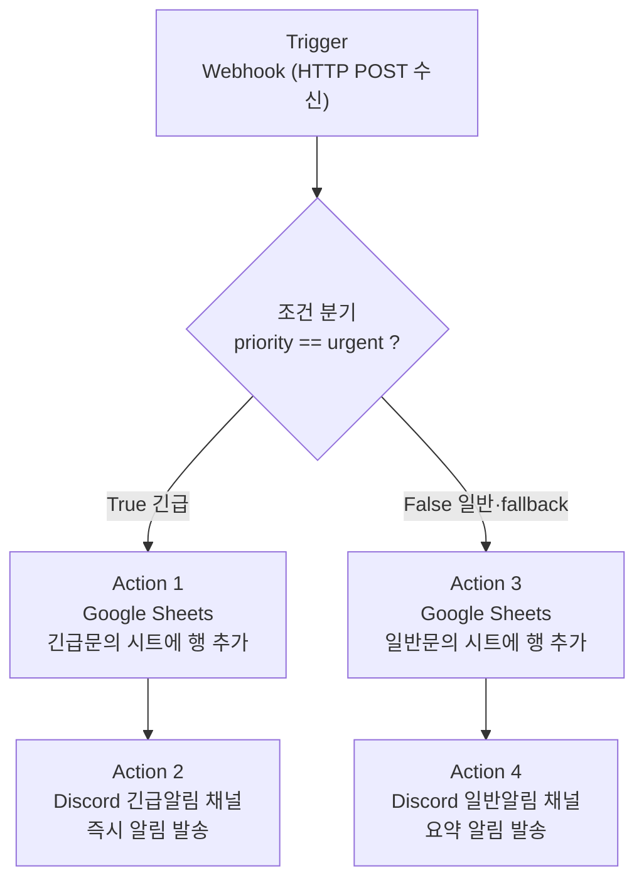
```mermaid
flowchart TD
    A["Trigger<br/>Webhook (HTTP POST 수신)"] --> B{"조건 분기<br/>priority == urgent ?"}
    B -->|True 긴급| C["Action 1<br/>Google Sheets<br/>긴급문의 시트에 행 추가"]
    C --> D["Action 2<br/>Discord 긴급알림 채널<br/>즉시 알림 발송"]
    B -->|False 일반·fallback| E["Action 3<br/>Google Sheets<br/>일반문의 시트에 행 추가"]
    E --> F["Action 4<br/>Discord 일반알림 채널<br/>요약 알림 발송"]
```

**요소별 정리**

| 구성요소 | 내용 |
|---|---|
| **Trigger** | Webhook — 외부에서 JSON을 POST하면 워크플로우가 시작된다 |
| **조건 분기** | `priority` 필드가 `urgent`인지 판정 |
| **Action 1 / 3** | Google Sheets — 긴급문의 / 일반문의 시트에 행 추가 |
| **Action 2 / 4** | Discord Webhook(HTTP POST) — 긴급알림 / 일반알림 채널에 메시지 발송 |

**Trigger로 Webhook을 선택한 이유**

폴링 방식 Trigger는 데이터가 없어도 확인할 때마다 실행량을 소모하고, Make 무료 플랜은 폴링 최소 간격이 15분이라 테스트 회전이 느리다. Webhook은 실제 요청이 있을 때만 실행되므로 무료 실행량을 절약하면서 테스트를 원하는 만큼 반복할 수 있다.

**입력 페이로드 스키마**

```json
{
  "ticket_id": "T-1001",
  "customer": "고객A",
  "category": "결제",
  "priority": "urgent",
  "message": "결제가 두 번 청구되었습니다"
}
```

**기록 대상 Google Sheets**

두 도구가 **같은 스프레드시트, 같은 시트**에 기록하도록 설계했다. 어느 도구가 기록했는지는 `source` 컬럼으로 구분한다. 도구별로 시트를 나누면 "동일 구조"라는 비교 전제가 흐려지기 때문이다.

| 파일 | 시트 | 컬럼 |
|---|---|---|
| `문의접수-자동화` | `긴급문의`, `일반문의` | 수신시각 / ticket_id / customer / category / priority / message / source |

**테스트 데이터 설계 (도구당 6건)**

분기 양쪽 경로를 모두 실행시키고, 경계 조건까지 확인하도록 구성했다.

| # | ticket_id (Make / n8n) | priority | 기대 경로 | 검증 의도 |
|---|---|---|---|---|
| 1 | T-1001 / T-2001 | `urgent` | True | 정상 긴급 |
| 2 | T-1002 / T-2002 | `urgent` | True | 정상 긴급 |
| 3 | T-1003 / T-2003 | `urgent` | True | 정상 긴급 |
| 4 | T-1004 / T-2004 | `normal` | False | 정상 일반 |
| 5 | T-1005 / T-2005 | `low` | False | `normal`이 아닌 값도 분기되는가 |
| 6 | T-1006 / T-2006 | **필드 없음** | False | **필드 자체가 없을 때의 처리** |

6번이 핵심 검증이다. 두 도구의 조건 분기 구현 방식이 다르므로(§1.5-6), 값이 존재하지 않는 경우의 처리가 갈릴 수 있다고 보고 의도적으로 포함했다.

---

### 1.2 도구 A — Make 구현 과정

**계정 및 환경**

Make 클라우드(us2 리전), Free 플랜. 별도 설치 없이 가입 후 바로 시나리오 생성이 가능했다.

**구현 순서**

1. `Create scenario from scratch`로 시나리오 생성 (이름: `P1-문의접수분류-Make`)
2. **Webhooks → Custom webhook** 모듈 배치 → Webhook URL 발급
3. `Detect new values` 클릭 후 테스트 요청 1회 전송 → 데이터 구조 인식
4. **Router** 배치 → 두 갈래 경로 생성
5. 경로 A: Google Sheets `Add a Row` + HTTP `Make a request`(Discord)
6. 경로 B: 동일 구성, 시트·채널만 변경
7. Router 경로별 Filter 설정
8. 저장 후 `Run once` 방식으로 테스트 6건 실행

> **AI 빌더(Maia)는 사용하지 않았다.** 시나리오 생성 시 좌측에 AI 빌더 패널이 기본으로 열리지만, Trigger·Action 구조를 직접 이해하는 것이 미션 목표이므로 모든 모듈을 수동 배치했다.

**막힌 지점과 해결**

| 지점 | 내용 | 해결 |
|---|---|---|
| 데이터 구조 인식 | Webhook URL을 받아도 필드가 잡히지 않음 | `Detect new values`로 **대기 상태를 만든 뒤** 요청을 보내야 인식된다. 대기 상태가 아닐 때 보낸 요청은 `There is no scenario listening for this webhook` 오류 반환 |
| fallback route | Router의 fallback 경로 지정 UI를 찾지 못함 | 경로 B에 `priority` `Not equal to` `urgent` 필터를 걸어 우회 (§1.5-6) |
| **변수 매핑 무음 실패** | `{{ticket_id}}` 형태 문자열을 붙여넣자 변수 태그로 변환되어 정상으로 보였으나, **실행 시 값이 전부 비어 있었음** | Make의 변수 참조는 모듈 번호가 포함된 형태여야 한다. 우측 변수 패널에서 필드를 클릭해 삽입하는 방식으로 4개 모듈 전부 재작업 |

세 번째가 가장 시간을 많이 소모했다. **실행은 "성공"으로 표시되고 오류도 발생하지 않은 채 값만 비어 있었기 때문에**, Discord 알림을 눈으로 확인하기 전까지 문제를 발견할 수 없었다. 이 특성은 §1.5-7 데이터 매핑 항목의 근거가 된다.

**구성 화면**

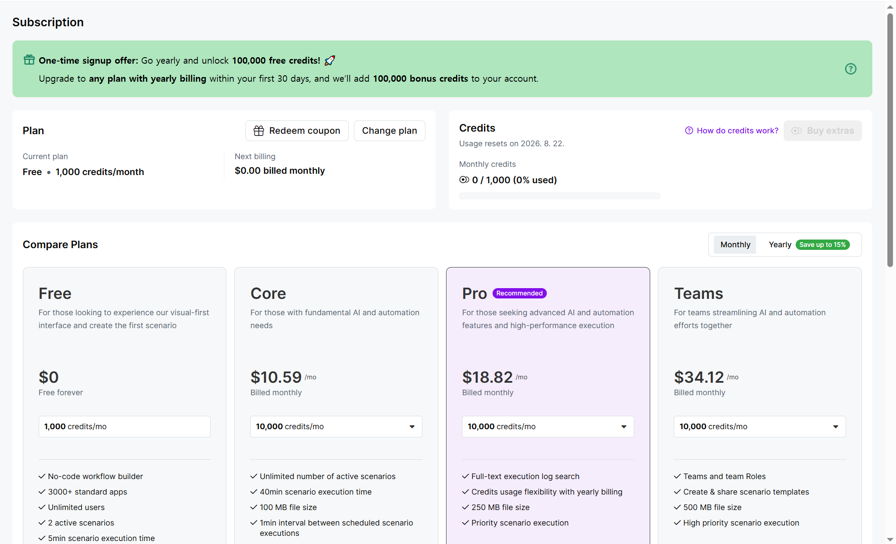
> **캡처 1 · Make Free 플랜 한도.** 현재 플랜이 Free(1,000 credits/month)이며 활성 시나리오 2개, 시나리오 실행시간 5분 제한이 명시되어 있다. §1.7 무료 플랜 범위의 1차 근거.

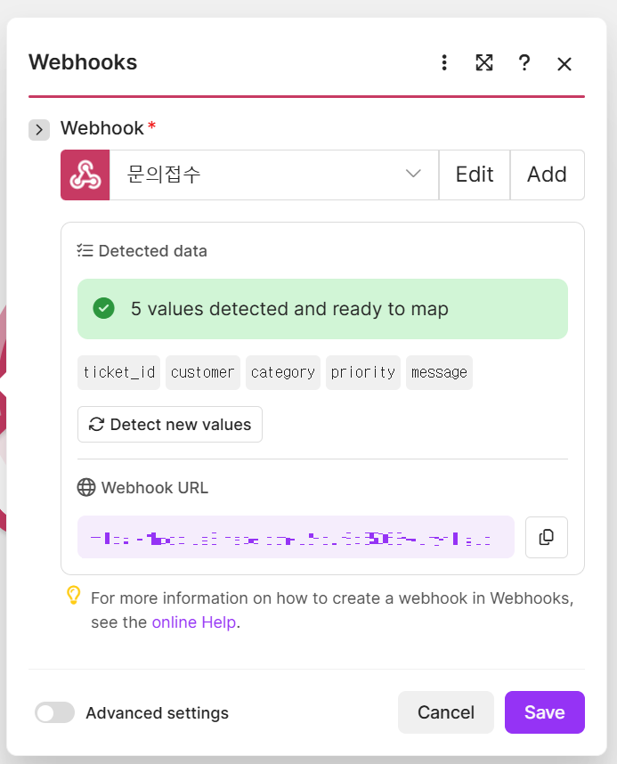
> **캡처 2 · Make Trigger 설정 완료.** Custom webhook 모듈이 테스트 요청을 받아 `5 values detected and ready to map`으로 필드 5개(ticket_id, customer, category, priority, message)를 인식했다. Trigger가 정상 동작함을 보여준다.

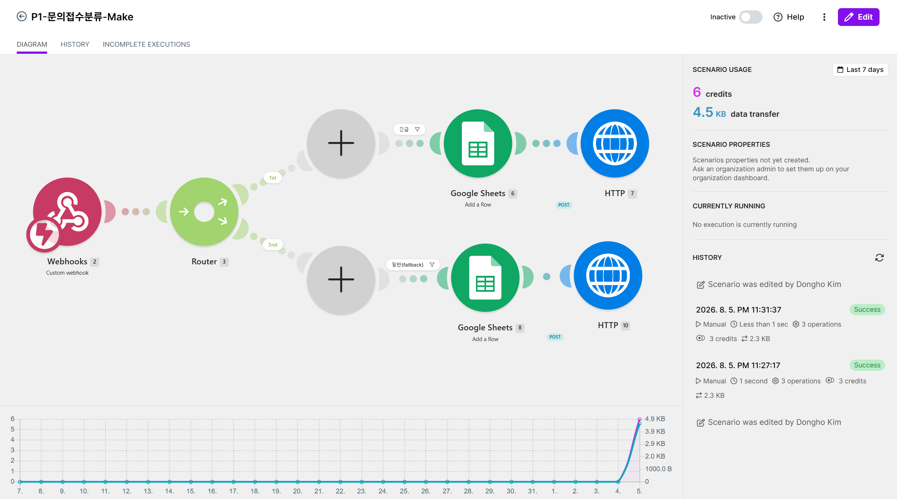
> **캡처 3 · Make 워크플로우 전체 구조.** Webhooks(Trigger) → Router(조건 분기) → 두 경로에 각각 Google Sheets + HTTP(Discord) Action이 배치되어 있다. 분기 라벨 `긴급`과 `일반(fallback)`이 각 경로에 표시된다. Trigger 1개, 조건 분기 1개, Action 4개로 요구사항을 충족한다.

---

### 1.3 도구 B — n8n(셀프호스팅) 구현 과정

**환경 구축**

Docker Desktop 설치 → WSL2 설치 → 재부팅 → 컨테이너 실행 순으로 진행했다.

```
docker run -it --rm -p 5678:5678 -v n8n_data:/home/node/.n8n docker.n8n.io/n8nio/n8n
```

Docker Desktop 설치 직후 `WSL not installed` 오류가 발생해 `wsl --install`과 재부팅이 추가로 필요했다. 이후 n8n 2.34.4가 정상 구동되어 `http://localhost:5678`로 접속했다.

**구현 순서**

1. 워크플로우 생성 (이름: `P1-문의접수분류-n8n`)
2. **Webhook** 노드 배치 → HTTP Method를 `POST`로 변경
3. `Listen for test event` 후 테스트 요청 전송 → 데이터 인식
4. **IF** 노드 배치 → 조건 `{{ $json.body.priority }}` `is equal to` `urgent`
5. true 출력: Google Sheets `Append Row` + HTTP Request(Discord)
6. false 출력: 동일 구성, 시트·채널만 변경
7. 게시 후 테스트 6건 실행

**막힌 지점과 해결**

| 지점 | 내용 | 해결 |
|---|---|---|
| WSL 미설치 | Docker Desktop 실행 시 오류 | `wsl --install` 후 재부팅 |
| **Google Sheets 인증** | Credential 설정에 Google Cloud 프로젝트가 직접 필요 | GCP 프로젝트 생성 → Sheets/Drive API 활성화 → OAuth 동의 화면 구성 → 테스트 사용자 등록 → 클라이언트 ID 발급 → 리디렉션 URI 등록. **18분 소요** (§1.5-3) |
| 데이터 구조 차이 | 페이로드가 `body` 객체 안에 중첩되어 `$json.priority`로는 참조 불가 | `$json.body.priority`로 참조. INPUT 패널에서 드래그하면 경로가 자동 계산된다 |
| 컨테이너 종료 | 컨테이너가 종료되자 워크플로우 전체가 정지 | 재실행. 셀프호스팅의 가용성 특성 (§1.5-9) |
| Production URL 404 | 게시했음에도 Production URL이 등록되지 않음 | Test URL 방식(`Execute workflow` 후 호출)으로 전환해 완수. 프로젝트 1은 자동 실행이 요구사항이 아니므로 검증에 지장 없음 |

Google 인증 구간이 이번 비교에서 가장 큰 차이를 만든 지점이다. Make는 자체 OAuth 앱이 이미 등록되어 있어 계정 선택만 하면 되지만, **n8n 셀프호스팅은 사용자가 직접 OAuth 앱 개발자가 되어야 한다.**

**구성 화면**

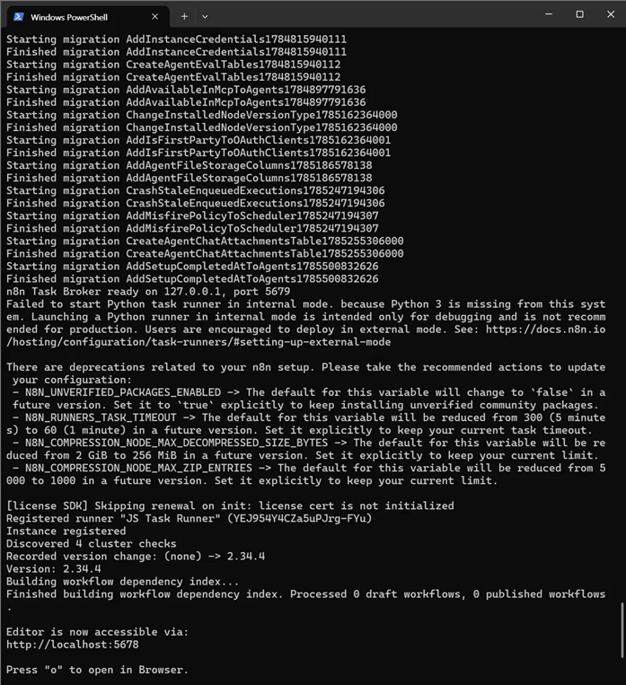
> **캡처 4 · n8n 셀프호스팅 구동 로그.** Docker 명령 한 줄로 n8n 2.34.4가 실행되어 `Editor is now accessible via: http://localhost:5678` 메시지를 출력했다. `license cert is not initialized` 표시대로 라이선스 인증 없이 구동되며, Make와 달리 실행량·활성 워크플로우 수 제한이 존재하지 않는다.

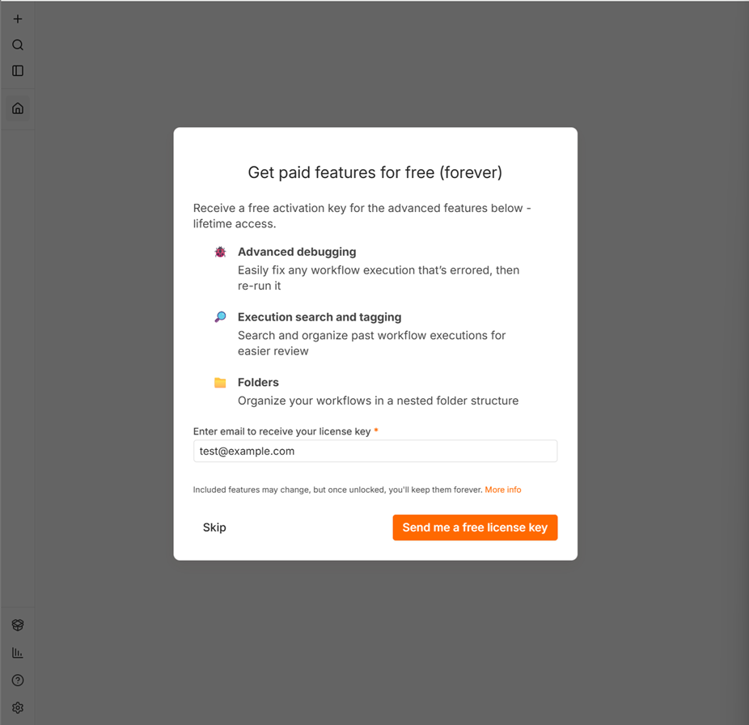
> **캡처 5 · n8n 무료 라이선스 키 안내.** 셀프호스팅은 실행량 제한이 없으나 일부 기능(Advanced debugging, Execution search and tagging, Folders)은 별도 라이선스 키 발급이 필요하다. §1.7의 근거이며, 특히 실행 검색 기능이 기본 제공되지 않는 점은 §1.5-5 비교와 연결된다.

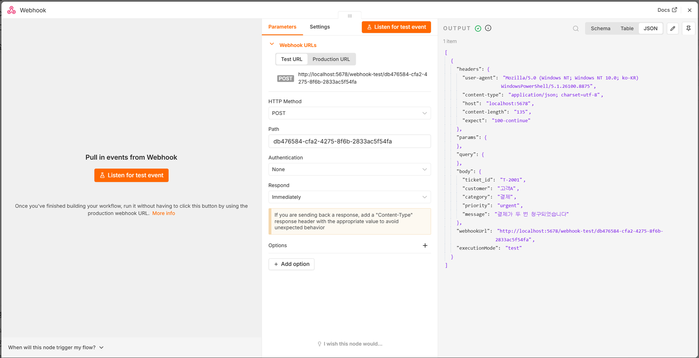
> **캡처 6 · n8n Trigger 설정 완료.** Webhook 노드가 테스트 요청을 수신해 OUTPUT에 JSON을 표시했다. 데이터가 `headers`, `params`, `query`, `body`로 구조화되어 있으며 실제 페이로드는 `body` 안에 중첩된다. Test URL과 Production URL이 분리 제공되는 점도 확인된다.

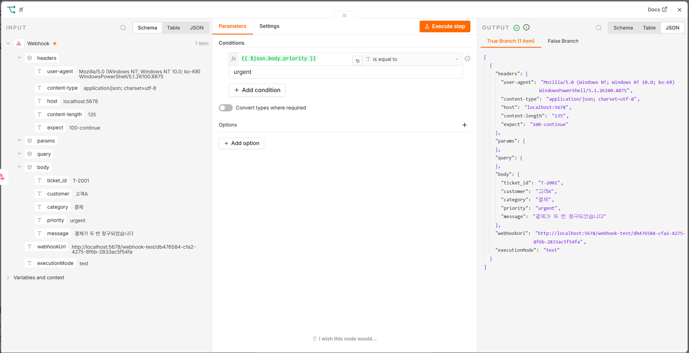
> **캡처 7 · n8n 조건 분기(IF 노드) 설정 및 단독 실행.** 조건 `{{ $json.body.priority }} is equal to urgent`를 설정하고 노드 단독 실행한 결과, OUTPUT에 `True Branch (1 item)` / `False Branch` 탭이 생성되어 입력 데이터가 True로 분류되었음을 보여준다. 워크플로우 전체를 실행하지 않고 노드 단위로 분기 판정을 검증할 수 있다.

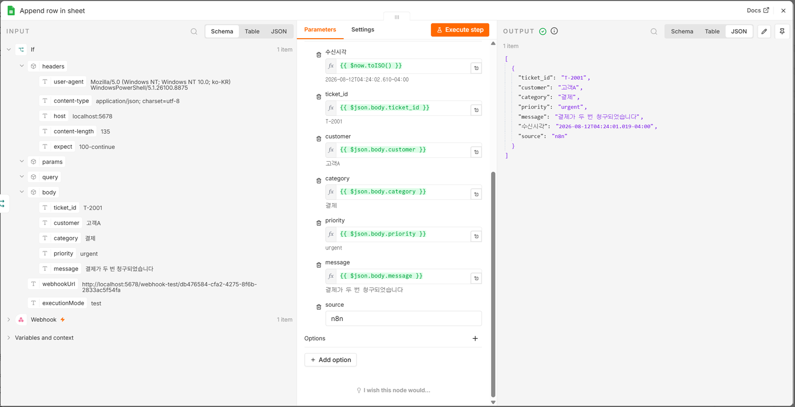
> **캡처 8 · n8n Google Sheets 컬럼 매핑.** 시트 헤더 이름(수신시각, ticket_id, customer …)이 그대로 입력 칸 라벨로 표시되며, 각 표현식 아래에 실제 치환 결과값(`T-2001`, `고객A`, `결제`)이 즉시 미리보기로 나타난다. Make의 A~Z 위치 기반 매핑과 대비되는 지점이다.

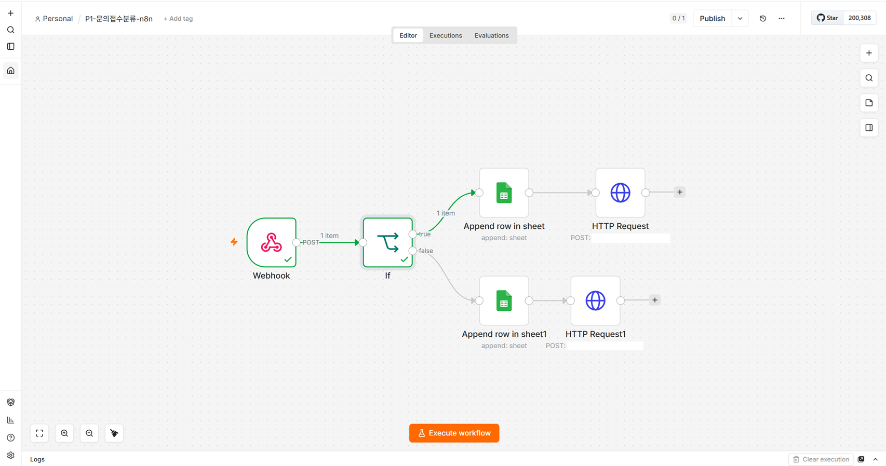
> **캡처 9 · n8n 워크플로우 전체 구조.** Webhook(Trigger) → If(조건 분기) → true/false 두 출력에 각각 Google Sheets + HTTP Request(Discord) Action이 연결되어 있다. Make와 **동일한 구조**로 이식되었으며, IF 노드의 `true`/`false` 출력이 기본 제공되는 점이 Make의 Router와 다르다.

---

### 1.4 분기별 실행 결과

두 도구 모두 테스트 데이터 6건을 실행해 **양쪽 분기 경로가 각각 최소 1회 이상 실행된 결과**를 확보했다.

#### 1.4-A 긴급 경로(True) 실행 결과

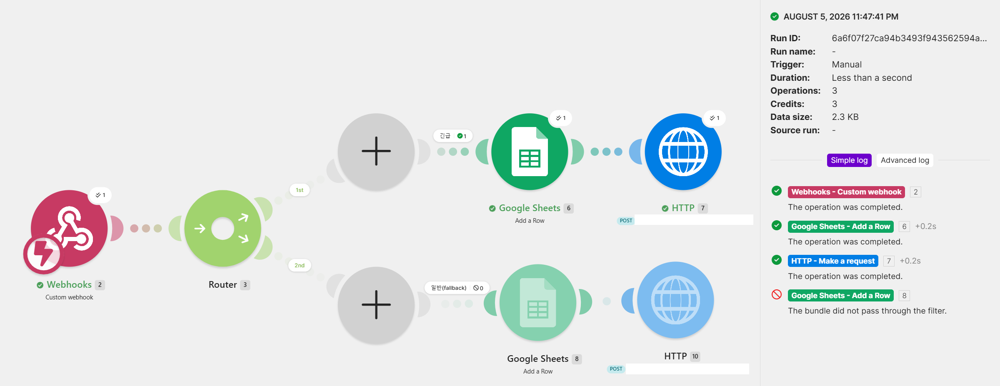
> **캡처 10 · Make 긴급 경로 실행 로그.** `priority=urgent` 입력이 Router의 `긴급` 경로로 라우팅되어 통과 건수 **1**로 표시되고, 해당 경로의 Google Sheets → HTTP(Discord) 두 Action이 모두 성공했다. 반대편 `일반(fallback)` 경로는 통과 건수 **0**이며, 우측 실행 로그에 해당 경로 모듈이 **"The bundle did not pass through the filter"**로 기록되어 조건 분기가 실제로 차단했음을 명시한다. 실행 시각 23:47:41.

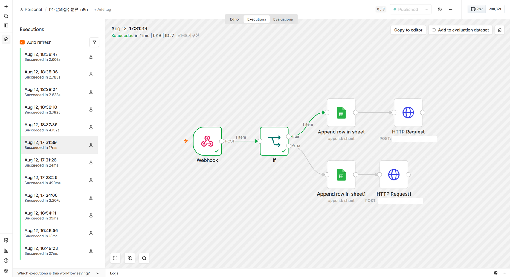
> **캡처 11 · n8n 긴급 경로 실행 로그.** `priority=urgent` 입력이 IF 노드의 `true` 출력으로 흘러 `1 item`이 전달되었다. true 경로의 Sheets/HTTP 노드에 성공 표시가 붙고, `false` 경로는 회색 비활성으로 표시되어 실행되지 않았음을 시각적으로 구분해 준다.

#### 1.4-B 일반 경로(False / fallback) 실행 결과

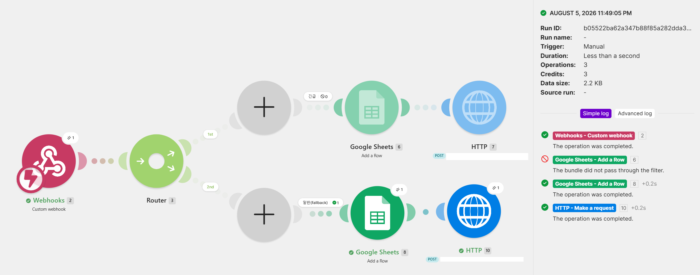
> **캡처 12 · Make 일반 경로 실행 로그.** `priority` 필드가 아예 없는 입력(T-1006)이 `일반(fallback)` 경로로 라우팅되어 통과 건수 **1**, `긴급` 경로는 **0**으로 캡처 10과 정확히 반대 결과를 보인다. 우측 로그에는 이번에는 긴급 경로 모듈이 **"The bundle did not pass through the filter"**로 기록되었다. 필터가 값의 부재까지 정상 처리했음을 증명한다. 실행 시각 23:49:05.

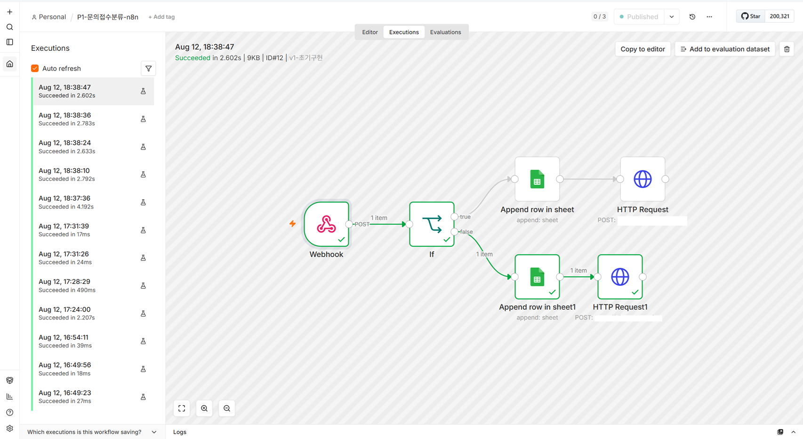
> **캡처 13 · n8n 일반 경로 실행 로그.** IF 노드의 `false` 출력이 초록색으로 활성화되어 `1 item`을 전달했고, 아래쪽 Sheets/HTTP 노드에 성공 표시가 붙었다. `true` 경로는 회색 비활성으로 캡처 11과 정확히 반대 결과다. 실행 시각 18:38:24.

#### 1.4-C Action 결과 확인

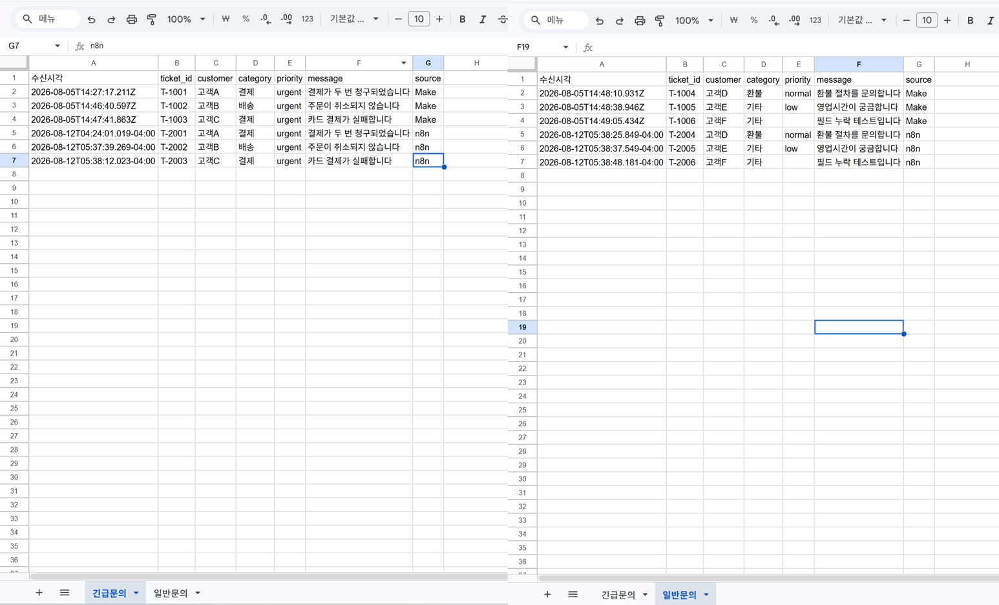
> **캡처 14 · Google Sheets 기록 결과 (Action 1/3).** 좌측 `긴급문의` 시트에는 `priority=urgent` 건만(Make T-1001~1003, n8n T-2001~2003), 우측 `일반문의` 시트에는 그 외 건만(Make T-1004~1006, n8n T-2004~2006) 기록되었다. `source` 컬럼으로 어느 도구가 기록했는지 구분된다.
> **주목할 결과:** `priority` 필드가 없는 T-1006(Make)과 T-2006(n8n)이 **둘 다 `일반문의` 시트에** 들어갔다. 조건 분기 구현 방식이 서로 다름에도(Make: `Not equal to` 필터 / n8n: IF false 출력) 값 부재를 동일하게 처리했음을 보여준다.

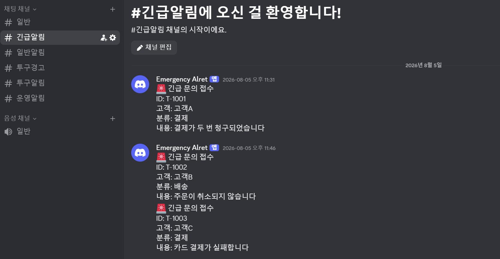
> **캡처 15 · Discord `#긴급알림` 채널 수신 결과 (Action 2).** 긴급 경로를 통과한 건만 이 채널로 전달되어 T-1001~1003의 알림이 수신되었다. 각 메시지에 ID·고객·분류·내용이 변수 치환되어 채워져 있다.

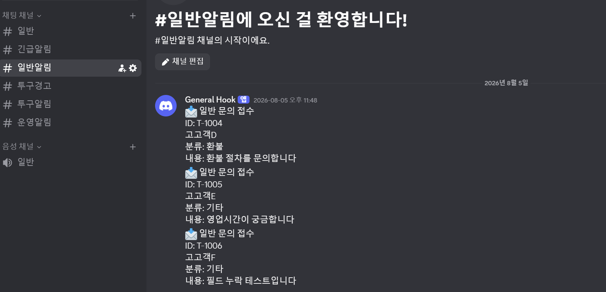
> **캡처 16 · Discord `#일반알림` 채널 수신 결과 (Action 4).** 일반 경로를 통과한 T-1004~1006의 알림이 수신되었다. 긴급 채널과 문구·이모지가 구분되어 있어 분기별로 서로 다른 Action이 실행되었음을 보여준다.

---

### 1.5 비교 분석

측정 조건을 맞추기 위해 **두 도구에서 공통으로 반복되는 구간만** 시간을 측정했다. Google Sheets 시트 준비, Discord 서버·채널 생성은 1회성이며 두 도구가 공용하므로 제외했다.

#### 소요 시간 측정 결과

| 구간 | Make | n8n | 비고 |
|---|---|---|---|
| 초기 진입 | **9분** | **13분** | Make: 가입 + 플랜 확인 / n8n: Docker·WSL 설치 + 재부팅 + 컨테이너 실행 |
| 워크플로우 구축 | **54분** | **70분** | 생성부터 첫 성공 실행까지 (n8n은 중단 45분 제외) |
| ㄴ 이 중 Google Sheets 인증 | 1~2분 | **18분** | |
| 분기 테스트 6건 | 26분 | 구축 시간에 포함 | |

> **측정 신뢰도에 관한 참고:** n8n 구축 시간 70분 중 약 10분은 도구 문제가 아니라 작업 중 Webhook URL 식별자를 잘못 입력해 발생한 404 반복에 소모되었다. 이를 제외하면 실질 격차는 약 6분이며, 격차의 대부분은 Google 인증 구간에서 발생했다.

#### 비교 항목 (9개)

| # | 항목 | Make | n8n (셀프호스팅) |
|---|---|---|---|
| 1 | **UI/UX** | 원형 노드 캔버스. 시나리오 생성 시 AI 빌더(Maia) 패널이 기본으로 열려 캔버스 폭을 차지한다. 모듈 설정은 별도 팝업 | 사각 노드 캔버스. 노드 클릭 시 **INPUT / Parameters / OUTPUT 3분할** 화면이 열려 입력·설정·출력을 한 화면에서 확인 |
| 2 | **설정 난이도** | 워크플로우 구축 **54분**. 최대 난관은 변수 매핑 무음 실패(재작업 필요) | 워크플로우 구축 **70분**. 최대 난관은 Google OAuth 직접 구성(18분) |
| 3 | **연동 인증 방식** | 자체 OAuth 앱 등록 상태. `Add` → 구글 계정 선택 → 승인, **1~2분** | GCP 프로젝트 생성 → API 2종 활성화 → OAuth 동의 화면 구성 → 테스트 사용자 등록 → 클라이언트 ID 발급 → 리디렉션 URI 등록, **18분** |
| 4 | **무료 플랜 범위** | 1,000 credits/월, 활성 시나리오 **2개**, 시나리오 실행시간 **5분**, 폴링 최소 간격 15분 | 실행량·워크플로우 수·실행시간 **제한 없음**. 단 Advanced debugging, Execution 검색·태깅, Folders는 별도 라이선스 키 필요 |
| 5 | **실행 로그 확인 방식** | History 탭. 실행별 operations·credits·데이터량 표시. 필터 차단 시 **"The bundle did not pass through the filter"** 명시 | Executions 탭. 실행별 소요시간·데이터량 표시. 실행 경로를 **캔버스에 색상으로 시각화**(실행 노드 활성색 / 미실행 노드 회색). 실행 검색은 유료 |
| 6 | **조건 분기 구현 방식** | **Router**로 경로를 나눈 뒤 각 경로에 **Filter**를 거는 2단 구조. fallback route 지정 UI를 찾지 못해 `Not equal to`로 우회 | **IF 노드**가 `true`/`false` 출력을 처음부터 두 개 제공. 별도 fallback 설정 불필요 |
| 7 | **데이터 매핑** | 페이로드를 **평면**으로 인식(`{{ticket_id}}`). Sheets는 **A~Z 위치 기반**. 문자열을 붙여넣으면 변수 태그로 보이지만 실제 참조가 없어 **오류 없이 빈 값**으로 실행됨 | 페이로드가 `body`에 **중첩**(`{{ $json.body.ticket_id }}`). Sheets는 **헤더 이름 기반**. 표현식 입력 즉시 **치환 결과값을 미리보기**로 표시 |
| 8 | **오류 메시지 품질** | 원인만 한 줄로 통보. 예: `There is no scenario listening for this webhook` | 원인 + **해결 방법 + 주의사항**을 함께 반환. 예: 워크플로우가 활성이어야 하며, 우측 상단 토글로 활성화할 수 있고, Production URL 호출은 캔버스에 표시되지 않고 실행 목록에서만 확인된다는 안내 포함 |
| 9 | **Webhook 대기 동작 / 가용성** | 대기 상태가 아닐 때 들어온 요청을 **큐에 적재**했다가 이후 `Run once` 시 소진. 요청은 보존되나 테스트 중 예기치 않은 중복 실행 발생. 서비스는 상시 가동 | 대기 상태가 아니면 **즉시 404로 거부**하고 해결 방법을 안내. 대신 **컨테이너가 종료되면 워크플로우 전체가 정지**한다 |

#### 항목별 측정·관찰 근거

**1. UI/UX** — Make는 새 시나리오 진입 시마다 AI 빌더 패널이 열려 있어 매번 닫아야 캔버스를 넓게 쓸 수 있었다. n8n의 3분할 화면은 노드 설정 중 좌측에서 입력 데이터를 보며 우측에서 결과를 즉시 확인할 수 있어 매핑 작업에 유리했다.

**2. 설정 난이도** — §1.2, §1.3의 "막힌 지점" 표가 근거다. 두 도구 모두 첫 관문은 Webhook 데이터 구조 인식이었고, 동작 원리(대기 상태에서만 수신)는 같았다.

**3. 연동 인증 방식** — 이 항목의 격차가 전체 구축 시간 차이의 대부분을 설명한다. 원인은 명확하다. Make는 플랫폼이 자체 OAuth 앱을 이미 구글에 등록해 둔 상태이므로 사용자는 승인만 하면 되지만, n8n 셀프호스팅은 **사용자 본인이 OAuth 앱 개발자 역할을 수행**해야 한다. 반대급부로 n8n은 데이터가 제3자 플랫폼을 경유하지 않고 본인 계정과 직접 연결된다.

**4. 무료 플랜 범위** — Make는 요금제 페이지에서 한도를 한 화면에 확인할 수 있었다(캡처 1). 다만 조건 분기(Router) 포함 여부는 플랜 카드에 명시되어 있지 않아 **실제 배치해 보고서야 사용 가능함을 확인**했다. n8n 셀프호스팅은 대응되는 요금제 화면 자체가 없으며, 구동 로그의 `license cert is not initialized`와 라이선스 키 안내 화면(캡처 9)이 근거다. 활성 시나리오 2개 제한은 이 미션에 직접 영향을 준다. 프로젝트 1과 프로젝트 2를 동시에 활성화하면 정확히 한도에 도달한다.

**5. 실행 로그 확인 방식** — Make는 텍스트 로그로 차단 사실을 명시하고, n8n은 캔버스 색상으로 경로를 시각화한다. 표현 방식이 다를 뿐 분기 판별에는 양쪽 모두 충분했다. 다만 n8n은 실행 검색·태깅이 유료라 실행이 쌓이면 특정 건을 찾기 어려울 수 있다.

**6. 조건 분기 구현 방식** — 이 항목에서 설계 철학 차이가 가장 뚜렷하다. Make의 Router는 경로를 N개로 늘릴 수 있는 범용 구조이고 조건은 각 경로의 Filter로 부여한다. n8n의 IF는 이분 판정에 특화되어 true/false가 고정 제공된다. **분기가 2개면 n8n이 간결하고, 3개 이상이면 Make의 Router가 자연스럽다.** 결과 동등성은 §1.4-C에서 확인되었다. 두 방식 모두 `priority` 필드 부재를 False 경로로 처리했다.

**7. 데이터 매핑** — 실무 영향이 가장 큰 항목이다. Make에서 변수가 빈 값으로 나간 사고는 **실행이 성공으로 표시되고 오류도 나지 않아** 최종 산출물을 눈으로 확인하기 전까지 발견할 수 없었다. n8n은 표현식 입력 시점에 치환 결과를 보여주므로 같은 유형의 사고가 구조적으로 발생하기 어렵다. 다만 n8n은 중첩 구조를 이해해야 참조 경로를 쓸 수 있어 초기 학습 부담이 있다(드래그 입력 시 경로 자동 계산으로 완화된다). 날짜 함수도 다르다. Make는 `{{now}}`로 UTC(`...Z`), n8n은 `{{ $now.toISO() }}`로 오프셋 포함 형식(`...-04:00`)을 반환했다.

**8. 오류 메시지 품질** — 동일한 상황(비활성 상태에서 Webhook 호출)에 대해 Make는 사실만, n8n은 조치 방법까지 안내했다. 실제로 n8n 오류 메시지만 읽고 원인을 바로 해결할 수 있었다.

**9. Webhook 대기 동작** — Make의 큐 적재는 운영 환경에서는 유실 방지라는 장점이지만, 테스트 중에는 이전에 보낸 요청이 나중에 한꺼번에 실행되어 시트와 Discord에 중복 기록을 만들었다. n8n은 즉시 거부하므로 테스트 결과가 명확하다.

---

### 1.6 도구별 장단점 및 상황별 적합성

#### Make

**장점**
- 가입 즉시 사용 가능하며 인프라 관리가 필요 없다
- 주요 서비스 연동 인증이 계정 선택 수준으로 끝난다 (Google Sheets 1~2분)
- Router 구조상 3개 이상 다분기 확장이 자연스럽다
- 서비스가 상시 가동되므로 사용자 환경(PC 전원, 컨테이너 상태)과 무관하게 워크플로우가 살아 있다

**단점**
- 무료 플랜 제약이 실사용에 곧바로 닿는다. 활성 시나리오 2개, 실행시간 5분, 폴링 15분 간격
- 변수 매핑이 오류 없이 조용히 실패할 수 있어 결과물을 직접 확인하기 전까지 문제를 인지하기 어렵다
- Sheets 매핑이 위치(A~Z) 기반이라 컬럼 순서가 바뀌면 데이터가 어긋난다
- 오류 메시지가 원인만 통보한다

#### n8n (셀프호스팅)

**장점**
- 실행량·워크플로우 수·실행시간 제한이 없고 과금 리스크가 없다
- 표현식 결과를 입력 시점에 미리보기로 확인할 수 있어 매핑 오류가 조기에 드러난다
- 노드 단위 단독 실행이 가능해 전체를 돌리지 않고 특정 노드만 검증할 수 있다
- IF 노드가 true/false를 기본 제공해 이분 분기가 간결하다
- 실행 경로가 캔버스에 색상으로 시각화된다
- 오류 메시지에 해결 방법이 포함된다
- 데이터가 제3자 플랫폼을 경유하지 않는다

**단점**
- 초기 진입에 Docker·WSL 설치와 재부팅이 필요하다
- 외부 서비스 연동 시 OAuth 앱을 직접 구성해야 한다 (Google Sheets 18분)
- 컨테이너가 종료되면 워크플로우가 정지한다. 상시 가동하려면 별도 서버가 필요하다
- 실행 검색·태깅, 고급 디버깅 등 일부 운영 기능이 라이선스 키를 요구한다
- 페이로드 중첩 구조를 이해해야 참조 경로를 작성할 수 있다

#### 상황별 적합성

| 상황 | 권장 | 이유 |
|---|---|---|
| 자동화를 처음 접하고 빠르게 결과를 보고 싶은 경우 | **Make** | 설치가 없고 연동 인증이 즉시 끝난다. 실패 지점이 적다 |
| Google Workspace·Slack 등 다수 SaaS를 폭넓게 연결하는 경우 | **Make** | 인증 절차가 서비스마다 반복되는데, 그 비용이 n8n에서 서비스 수만큼 누적된다 |
| 분기가 3개 이상으로 늘어나는 워크플로우 | **Make** | Router가 다분기에 자연스럽다 |
| 실행 건수가 많거나 예측하기 어려운 경우 | **n8n** | Make 무료 1,000 credits는 4모듈 기준 약 330회에 소진된다 |
| 5분을 초과하는 장시간 처리, 대량 데이터 순회 | **n8n** | Make Free는 시나리오 실행시간이 5분으로 제한된다 |
| 여러 워크플로우를 동시에 운영해야 하는 경우 | **n8n** | Make Free의 활성 시나리오 2개 제한이 곧바로 걸린다 |
| 데이터가 외부 플랫폼을 경유하면 안 되는 경우 | **n8n** | 셀프호스팅이므로 데이터가 자체 인프라에 머문다 |
| 개인 PC 외에 상시 가동 서버가 없는 경우 | **Make** | n8n은 컨테이너가 꺼지면 워크플로우도 멈춘다 |

**종합 판단**

두 도구는 우열 관계가 아니라 **초기 비용과 운영 자유도를 맞바꾸는 관계**다. Make는 시작이 빠른 대신 무료 범위의 천장이 낮고, n8n은 사용 가능 상태까지 31분(초기 진입 13분 + Google 인증 18분)이 들어 Make의 약 11분(초기 진입 9분 + 인증 1~2분)보다 **20분가량을 더 쓰는 대신** 이후 제약이 사실상 없다. 이번 워크플로우처럼 **연동 서비스가 적고 실행이 잦은 구조라면 초기 비용이 빠르게 회수되므로 n8n이 유리하고**, 반대로 **연동 서비스가 많고 실행이 드문 구조라면 인증 비용이 서비스마다 누적되므로 Make가 유리하다.**

---

### 1.7 무료 플랜 범위 및 유료 기능 사용 여부

**전 과정을 무료 플랜 내에서 완수했으며, 유료 결제를 사용하지 않았다.**

#### Make

| 항목 | 내용 | 확인 방법 |
|---|---|---|
| 플랜 | Free · 1,000 credits/월 | Subscription 페이지 (캡처 1) |
| 활성 시나리오 | 2개 | 동일 |
| 시나리오 실행시간 | 5분 | 동일 |
| 폴링 최소 간격 | 15분 | 동일 |
| **조건 분기(Router)** | **무료 플랜에서 사용 가능** | 플랜 카드에 명시되어 있지 않아 **실제 배치로 확인** (캡처 3) |
| 실제 소비량 | 실행 1회당 3 credits | History 탭 실행 상세 |

Subscription 화면에서 한도를 한눈에 확인할 수 있었던 점은 장점이나, **조건 분기 포함 여부가 명시되어 있지 않아 착수 전 확인이 불가능**했다. 실제 배치해 보고서야 사용 가능함을 확인했다.

가입 시 "30일 내 연간 결제 시 100,000 크레딧 추가" 프로모션이 표시되었으나 **사용하지 않았다.** 미션 요건이 무료 완수이며, 이번 워크플로우 규모에서 유료 전환이 필요한 이유가 없었다.

실행 1회당 3 credits이므로 1,000 credits로 약 330회 실행이 가능하다. 테스트 6건 및 재실행을 포함해도 무료 범위 내에서 충분했다.

#### n8n (셀프호스팅)

| 항목 | 내용 | 확인 방법 |
|---|---|---|
| 실행량 제한 | 없음 | 요금제 화면 자체가 존재하지 않음 |
| 워크플로우 수 제한 | 없음 | 동일 |
| 실행시간 제한 | 없음 | 동일 |
| 라이선스 | 미인증 상태로 구동 | 구동 로그 `license cert is not initialized` (캡처 4) |
| **유료(라이선스 키) 기능** | Advanced debugging, Execution 검색·태깅, Folders | 라이선스 안내 화면 (캡처 5) |

셀프호스팅이므로 실행량 기반 과금이 없고, 대응되는 요금제 페이지도 존재하지 않는다. 대신 **일부 운영 편의 기능이 무료 라이선스 키 발급을 요구**하는데, 이번 구현에는 필요하지 않아 발급하지 않고 진행했다.

Python 코드 노드는 컨테이너에 Python 3가 없어 사용할 수 없었으나, 이번 워크플로우에서는 사용하지 않았으므로 영향이 없었다.

**무료 대안 관련** — 유료 기능을 사용하지 않았으므로 별도 대안 검토가 필요하지 않았다. 다만 Make의 활성 시나리오 2개 제한은 프로젝트 1·2를 동시에 운영할 경우 정확히 한도에 도달하므로, 프로젝트 2에서 이 제약이 문제가 될 경우 n8n을 선택하는 것이 무료 범위 내 해법이 된다.

---

## 2. 프로젝트 2 — 자유 주제 자동화

### 2.1 반복 업무 정의

**주제: 고교야구 투구수 규정 자동 점검**

**현재 수작업으로 이루어지는 업무**

경기 종료 후 투수별 투구수를 기록하고, 대한야구소프트볼협회(KBSA) 규정에 따라 등판 가능 여부와 의무 휴식일을 판단해 감독에게 알리는 일이다. 지금은 기록원이 수기로 집계하고, 규정표를 눈으로 대조하고, 메신저로 전달한다.

**자동화가 필요한 이유**

이 업무는 세 가지 조건을 모두 충족한다.

- **반복성** — 경기마다, 투수마다 발생한다
- **규칙성** — 판단 기준이 규정으로 명문화되어 있어 사람의 재량이 개입할 여지가 없다
- **누락 시 위험** — 단순 실수가 미성년 선수의 부상으로 이어질 수 있다

특히 세 번째가 자동화 명분이다. 투구수 제한은 편의를 위한 규칙이 아니라 **성장기 선수의 어깨·팔꿈치 부상을 막기 위한 안전 규정**이다.

**적용 규정 (KBSA, 2018년 도입)**

| 투구수 | 의무 휴식일 |
|---|---|
| 45구 이하 | 없음 |
| 46~60구 | 1일 |
| 61~75구 | 2일 |
| 76~90구 | 3일 |
| 91~105구 | 4일 |
| **105구 도달** | **자동 교체 — 추가 투구 불가** |

> 규정상 105구에 도달하면 그 자리에서 교체해야 하므로, **106구 이상이 기록되었다는 것은 이미 규정을 위반한 상태**를 뜻한다. 이 워크플로우의 `초과` 경로(투구수 > 105)는 사후 적발과 즉시 조치 안내를 담당한다.

이 규정은 **분기 조건 그 자체**다. 자동화를 위해 인위적으로 만든 조건이 아니라, 업무에 이미 존재하는 판단 기준을 그대로 워크플로우로 옮긴 것이다.

> **개인정보 처리 방침**
> 대상이 고교 선수, 즉 미성년자이므로 구현·테스트 전 과정에서 실명·실제 팀명·연락처를 사용하지 않았다. 선수는 `투수A`~`투수F`, 팀은 `청룡고`·`백호고` 등 가상 명칭으로 통일했다.

---

### 2.2 도구 선정 및 선정 이유

**선정: Make (클라우드)**

프로젝트 1에서 두 도구를 직접 구현하며 측정한 데이터를 근거로 선정했다. 선정 사유는 세 가지다.

**① 자동 실행 요구사항과 셀프호스팅의 가용성 문제**

프로젝트 2는 "Trigger 발생 시 자동 실행"이 필수 요구사항이다. n8n 셀프호스팅은 **컨테이너가 종료되면 워크플로우 전체가 정지**하는데, 프로젝트 1 진행 중 실제로 컨테이너 종료로 실행이 멈추는 상황을 겪었다(§1.5-9). 상시 가동 서버 없이 개인 PC에서 운영하는 환경에서는 자동 실행의 지속성을 보장할 수 없다.

반면 Make는 클라우드 서비스이므로 PC 전원이나 프로그램 상태와 무관하게 스케줄러가 동작한다. **자동 실행 증거를 확보해야 하는 이번 과제에서 이 차이는 결정적이다.**

**② 다분기 구조에서 Router의 이점**

이번 워크플로우는 분기가 3개다. 프로젝트 1 §1.6에서 "분기가 3개 이상이면 Make의 Router가 자연스럽다"고 정리했는데, 이를 실제로 검증하는 사례가 되었다. n8n의 IF 노드는 true/false 이분 판정에 특화되어 있어 3분기를 만들려면 IF를 중첩하거나 Switch 노드를 별도로 써야 한다.

**③ 인증 비용이 이미 지불된 상태**

프로젝트 1에서 Make의 Google Sheets 연결을 이미 마쳤다. n8n은 동일 작업에 18분이 소요됐고(§1.5-3), 이번에 추가로 필요한 Google Gemini 연동에서도 같은 격차가 반복될 가능성이 높다.

**Make를 선택함으로써 감수한 제약**

| 제약 | 대응 |
|---|---|
| 활성 시나리오 2개 제한 | 프로젝트 1 시나리오를 비활성화하고 진행 |
| 폴링 최소 간격 15분 | 실시간성이 요구되는 업무가 아니므로 수용. 오히려 **사람의 개입 없이 대기 후 실행됨**을 보여주는 근거가 됨 |
| 월 1,000 credits | 실행 1건당 약 3 credits, 경기 단위 발생 빈도상 충분 |

---

### 2.3 워크플로우 설계

**전체 구조**

```
Trigger(Sheets 신규 행) → Router 3분기 ┬ 초과(106구~)   → AI 문구 생성 → 로그 기록 → Discord #투구경고
                                        ├ 휴식필요(46~105구) → AI 문구 생성 → 로그 기록 → Discord #투구알림
                                        └ 정상(~45구)   → 로그 기록 → Discord #투구알림
```

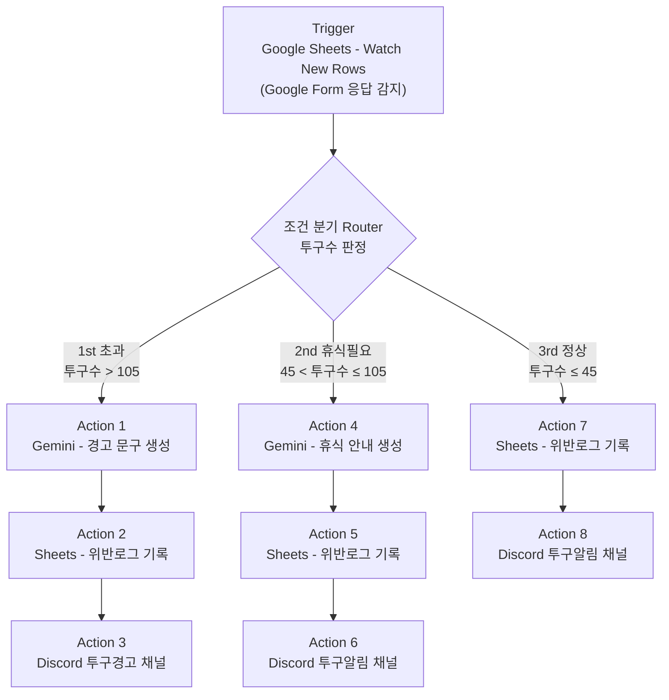
```mermaid
flowchart TD
    A["Trigger<br/>Google Sheets - Watch New Rows<br/>(Google Form 응답 감지)"] --> B{"조건 분기 Router<br/>투구수 판정"}

    B -->|"1st 초과<br/>투구수 &gt; 105"| C1["Action 1<br/>Gemini - 경고 문구 생성"]
    C1 --> C2["Action 2<br/>Sheets - 위반로그 기록"]
    C2 --> C3["Action 3<br/>Discord 투구경고 채널"]

    B -->|"2nd 휴식필요<br/>45 &lt; 투구수 ≤ 105"| D1["Action 4<br/>Gemini - 휴식 안내 생성"]
    D1 --> D2["Action 5<br/>Sheets - 위반로그 기록"]
    D2 --> D3["Action 6<br/>Discord 투구알림 채널"]

    B -->|"3rd 정상<br/>투구수 ≤ 45"| E1["Action 7<br/>Sheets - 위반로그 기록"]
    E1 --> E2["Action 8<br/>Discord 투구알림 채널"]
```

**요소별 정리**

| 구성요소 | 내용 |
|---|---|
| **Trigger** | Google Sheets `Watch New Rows` — Google Form 제출 시 응답 시트에 행이 추가되고, Make가 15분 주기 폴링으로 이를 감지해 **자동 실행**한다 |
| **조건 분기** | Router 3분기. 각 경로에 배타적 Filter 적용 |
| **Action (경로 1·2)** | Gemini 문구 생성 → Sheets 기록 → Discord 알림 (각 3개) |
| **Action (경로 3)** | Sheets 기록 → Discord 알림 (2개) |

**Router 분기 조건**

| 경로 | Label | Filter 조건 | 규정 근거 |
|---|---|---|---|
| 1st | `초과` | 투구수 `Numeric: Greater than` 105 | 105구 초과 시 등판 불가 |
| 2nd | `휴식필요` | 투구수 `Greater than` 45 **AND** `Less than or equal to` 105 | 46구 이상부터 의무 휴식 발생 |
| 3rd | `정상` | 투구수 `Less than or equal to` 45 | 45구 이하는 휴식 불필요 |

**조건을 배타적으로 설계한 이유** — Make Router는 위에서부터 순차 평가하므로 조건이 겹쳐도 동작은 한다. 그러나 세 조건을 서로 겹치지 않게 만들면 **경로 순서가 바뀌거나 경로를 추가해도 판정 결과가 달라지지 않는다.** 프로젝트 1에서 fallback route를 찾지 못해 우회했던 경험(§1.5-6)을 반영해, 이번에는 모든 경로에 명시적 조건을 부여했다.

**Trigger로 Sheets 폴링을 선택한 이유**

프로젝트 1은 Webhook을 썼으나, 프로젝트 2는 **자동 실행 증명**이 목적이므로 성격이 다르다. Webhook은 외부에서 요청을 보내야 하는데, 그 요청을 사람이 보내면 "자동"이라 보기 어렵다. Google Form 제출은 기록원의 자연스러운 업무 행위이고, 그 이후 감지·판정·알림 전 과정에 사람이 개입하지 않는다.

**계산 책임의 배치**

당초 설계는 Google Sheets 수식이 판정하고 Make가 결과만 읽는 구조였다. 그러나 **Google Forms가 응답을 삽입할 때 수식 열을 덮어써 `#REF!` 오류가 반복 발생**했다(§5 작업 로그 참조). 재발이 예상되어 **판정 로직을 Make Router로 이관**했다.

결과적으로 이 변경이 설계상 더 나았다.

| 항목 | 변경 전 | 변경 후 |
|---|---|---|
| 판정 위치 | 시트 수식 | Make Router Filter |
| 규정 숫자의 소재 | 시트 수식 내부 | **Router 조건에 직접 노출** |
| 실패 지점 | 시트 수식 → Make 읽기 → 분기 (3단계) | Make 분기 (1단계) |
| 폼 응답 삽입의 영향 | 수식 파괴 | 없음 |

`105`, `45`라는 규정 숫자가 Router 조건에 그대로 드러나므로 **조건 분기 설계 의도가 워크플로우 자체에서 읽힌다.**

**AI의 역할 범위**

AI는 **분기 이후**에만 배치했다. 판정은 규칙(Router Filter)이 하고, AI는 확정된 판정 결과를 사람이 읽을 문장으로 바꾸는 일만 한다.

판정을 AI에게 맡기지 않은 이유는 두 가지다. 첫째, 조건 분기가 요구사항인 과제에서 판정 기준이 명시적이어야 한다. 둘째, **AI 응답은 매번 달라질 수 있어 안전 규정 판단에는 부적합하다.** 같은 투구수에 대해 다른 판정이 나오면 규정 준수 도구로서 신뢰할 수 없다.

**입력 데이터 스키마 (Google Form)**

| 필드 | 유형 | 예시 |
|---|---|---|
| 경기일 | 날짜 | 2026-08-13 |
| 팀명 | 단답형 | 청룡고 |
| 투수 | 단답형 | 투수A |
| 투구수 | 단답형(숫자) | 110 |
| 상대팀 | 단답형 | 백호고 |

**기록 대상 시트: `위반로그`**

```
기록시각 | 경기일 | 팀명 | 투수 | 투구수 | 판정 | 안내문구
```

`판정` 컬럼은 각 경로에서 고정값(`초과`/`휴식필요`/`정상`)으로 기록하고, `안내문구`에는 AI 생성 결과를 저장한다. 경로 3은 AI를 거치지 않으므로 `규정 내 정상 투구` 고정 문구가 들어간다.

**테스트 데이터 (6건)**

세 경로를 각각 2회 이상 실행시키도록 구성했다.

| # | 경기일 | 팀명 | 투수 | 투구수 | 상대팀 | 기대 경로 |
|---|---|---|---|---|---|---|
| 1 | 2026-08-13 | 청룡고 | 투수A | 110 | 백호고 | 초과 |
| 2 | 2026-08-14 | 청룡고 | 투수B | 95 | 주작고 | 휴식필요 |
| 3 | 2026-08-15 | 청룡고 | 투수C | 40 | 현무고 | 정상 |
| 4 | 2026-08-16 | 청룡고 | 투수D | 120 | 백호고 | 초과 |
| 5 | 2026-08-17 | 청룡고 | 투수E | 58 | 주작고 | 휴식필요 |
| 6 | 2026-08-18 | 청룡고 | 투수F | 30 | 현무고 | 정상 |

투구수를 95·58(휴식 4일·1일 구간)과 110·120(초과분 5구·15구)으로 다르게 배치해, AI가 구간별로 다른 안내를 생성하는지도 함께 검증했다.

---

### 2.4 구현 화면

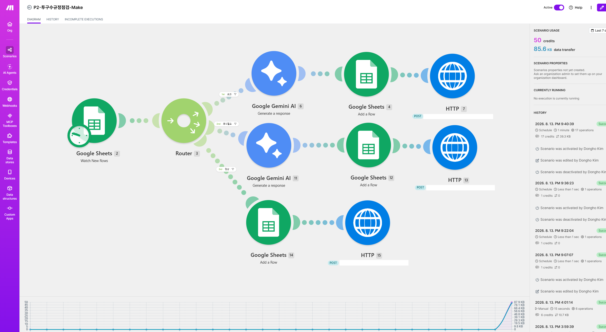
> **캡처 17 · 프로젝트 2 워크플로우 전체 구조.** Google Sheets `Watch New Rows`(**Trigger**, 시계 아이콘은 스케줄 폴링을 의미) → **Router**(조건 분기)에서 `1st 초과` / `2nd 휴식필요` / `3rd 정상` 세 경로로 갈라지며, 각 경로에 **Action**이 배치되어 있다. 경로 1·2는 Gemini → Sheets → HTTP 3개, 경로 3은 Sheets → HTTP 2개다. 우측 상단 `Active` 표시로 시나리오가 활성 상태임을 확인할 수 있다.

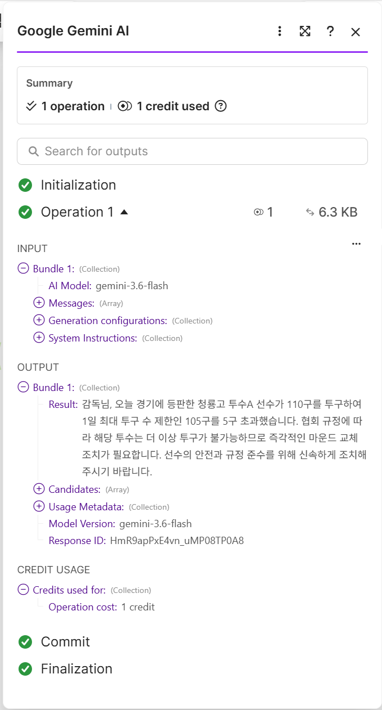
> **캡처 18 · AI 연동 Action(Google Gemini) 모듈 실행 결과.** System Instructions에 KBSA 규정을 제공하고 Messages에 경기 데이터를 매핑한 결과, `Result` 필드에 한국어 안내 문장이 생성되었다. 입력 투구수(110구)에 대해 초과분 5구를 스스로 계산하고 즉각적인 교체 조치 필요성까지 서술했다. 모델은 Gemini Flash 계열을 사용했다.

**AI 프롬프트 구성**

System Instructions에는 역할과 규정을 고정 텍스트로 넣고, Messages에는 경기 데이터를 변수로 매핑했다.

```
[System Instructions]
너는 고교야구 투수 관리 담당자다. 감독에게 보낼 안내 메시지를 한국어로 3문장 이내로 작성한다.
규정(대한야구소프트볼협회 기준): 고교 투수는 하루 최대 105구까지 던질 수 있으며 초과 시 등판 불가다.
의무 휴식일은 46~60구 1일, 61~75구 2일, 76~90구 3일, 91~105구 4일이다.
이모지와 마크다운은 사용하지 말고 평문으로만 작성한다.

[Messages / User]
아래 투수가 규정 상한을 초과했다. 초과 구수를 명시하고 즉각적인 조치가 필요함을 알려라.
경기일: {{경기일}}   팀: {{팀명}}   투수: {{투수}}   투구수: {{투구수}}
```

경로 2(휴식필요)는 마지막 지시문만 "의무 휴식일수를 명시하고 다음 등판 가능 시점을 안내하라"로 교체했다. **규정 정보는 System Instructions에 두고 경로별 지시만 바꾸는 구조**이므로, 규정이 개정되어도 수정 지점이 한 곳으로 한정된다.

---

### 2.5 자동 실행 검증

**프로젝트 2의 필수 요구사항이다.** 프로젝트 1은 `Run once`(수동 실행)로 검증했으나, 여기서는 Trigger가 스스로 발동해야 한다.

**검증에서 증명해야 하는 것은 두 가지다.** ① 실행이 `Manual`이 아닌 스케줄러에 의해 발생했을 것 ② 그 실행이 폼 제출 데이터를 실제로 처리했을 것.

**실제 진행 경과**

| 시각 | 사건 | 주체 | 처리 건수 |
|---|---|---|---|
| 21:07:07 | `Schedule` 폴링 (활성화 직후) | 스케줄러 | 1 op (신규 행 0건) |
| 21:10~21:12 | Google Form 6건 제출 | 사람 | — |
| 21:22:04 | `Schedule` 폴링 | 스케줄러 | 1 op (**신규 행 미감지**) |
| 21:36:23 | `Schedule` 폴링 | 스케줄러 | 1 op (**신규 행 미감지**) |
| 21:37~21:40:36 | Trigger 시작 지점 재설정 후 재활성화 | 사람 | — |
| **21:40:39** | **`Schedule` 실행 — 6건 처리** | **스케줄러** | **17 op / 39.3 KB** |

**21:22·21:36 폴링이 신규 행을 감지하지 못한 이유** — Trigger(`Watch New Rows`)는 마지막으로 처리한 행 번호를 기준으로 그 이후 행만 가져온다. 초기 설정에서 `Choose manually`로 특정 행을 지정한 뒤, 사전 테스트 과정에서 시트 행을 여러 차례 삭제·재입력하면서 Make가 기억하는 행 번호와 실제 데이터 위치가 어긋났다. 이를 `All`로 재설정한 뒤 정상 감지되었다.

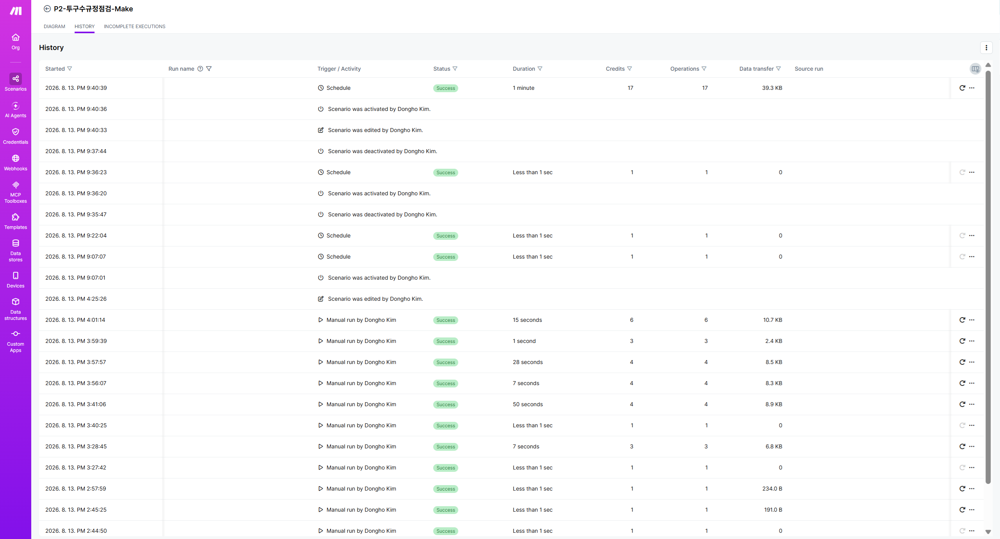
> **캡처 19 · 프로젝트 2 자동 실행 검증.** 21:40:39 실행의 `Trigger / Activity` 열이 **`Schedule`**로 기록되어 있다. 같은 목록 하단의 실행들이 `Manual run by ...`로 표시되는 것과 명확히 대비되며, **해당 실행이 사람의 `Run once` 조작이 아니라 스케줄러에 의해 발생했음**을 보여준다.
> 처리량에서도 구분된다. 21:07·21:22·21:36의 `Schedule` 실행은 `1 operations / 0 KB`(신규 행 미감지)인 반면, 21:40:39는 **`17 operations / 39.3 KB`**로 폼 응답 6건을 실제로 처리했다.
> 목록 중간의 `Scenario was deactivated / edited / activated by ...` 항목은 위 표의 Trigger 시작 지점 재설정 작업이며, **워크플로우 실행 자체를 사람이 트리거한 기록이 아니다.**

**자동 실행 요건 충족 판단**

사람이 수행한 조작은 **시나리오 활성화와 Trigger 시작 지점 설정**까지이며, 이는 워크플로우를 "가동 상태로 두는" 행위다. 데이터 유입(폼 제출)부터 감지·판정·기록·알림에 이르는 실행 과정에는 개입하지 않았고, 실행 트리거는 `Manual`이 아닌 `Schedule`로 기록되었다. 또한 21:07·21:22·21:36에 걸쳐 **폴링이 반복 발생**한 사실 자체가 스케줄러가 사람과 무관하게 주기적으로 동작하고 있음을 보여준다.

---

### 2.6 분기별 실행 결과

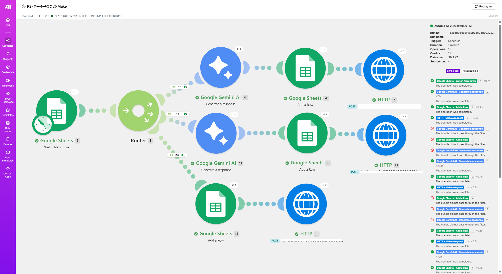
> **캡처 20 · Router 3분기 실행 결과.** 21:40:39 자동 실행 상세 화면이다. 우측 정보에 `Trigger: Schedule`, `Operations: 17`이 표시되며, Router의 세 경로 라벨에 각각 **통과 건수 2**가 붙어 있다(`1st 초과` 2건 / `2nd 휴식필요` 2건 / `3rd 정상` 2건). **조건 분기 3개 경로가 모두 1회 이상 실행되었음**을 하나의 화면에서 증명한다.
> 우측 실행 로그에는 `The bundle did not pass through the filter` 항목이 반복 표시되는데, 이는 각 데이터가 해당하지 않는 경로에서 **Filter에 의해 실제로 차단**되었음을 의미한다.

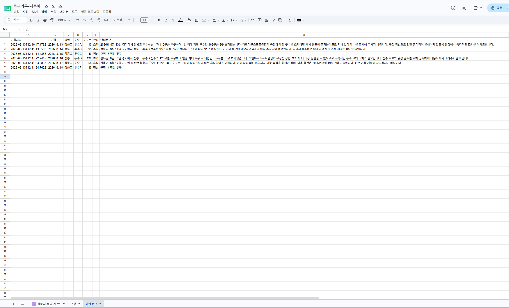
> **캡처 21 · `위반로그` 시트 기록 결과 (Action).** 폼으로 제출한 6건이 모두 기록되었으며 `판정` 컬럼이 초과 2건(투수A 110구·투수D 120구), 휴식필요 2건(투수B 95구·투수E 58구), 정상 2건(투수C 40구·투수F 30구)으로 갈렸다. `안내문구` 컬럼에는 경로 1·2의 AI 생성 문장이, 경로 3에는 고정 문구 `규정 내 정상 투구`가 저장되었다.

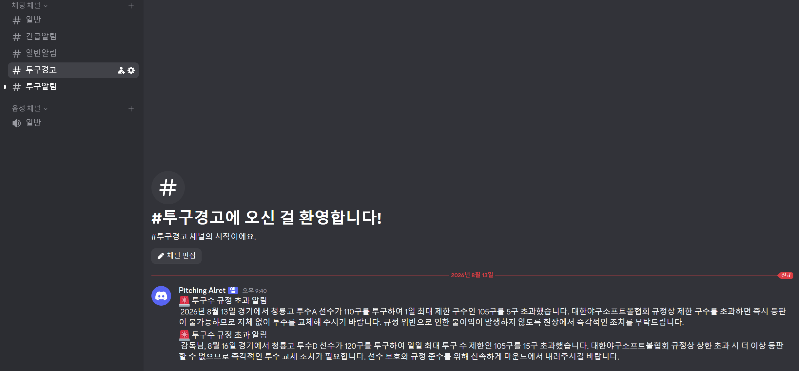
> **캡처 22 · 초과 경로 Action 결과 (`#투구경고` 채널).** 106구 이상인 2건만 이 채널로 전달되었다. 투수A(110구)에는 "105구를 5구 초과", 투수D(120구)에는 "15구 초과"로 **초과분이 각각 다르게 계산**되어 있으며, 두 건 모두 즉각적인 교체 조치 필요성을 규정 근거와 함께 안내한다.

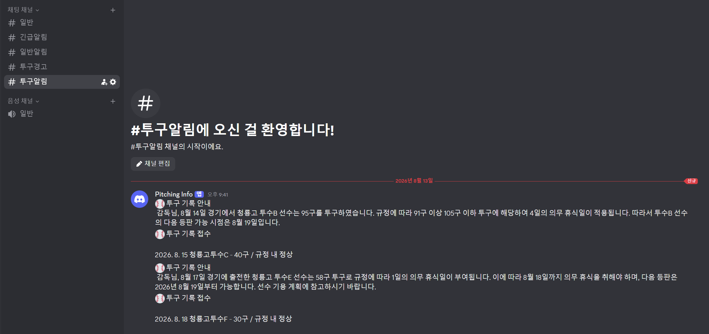
> **캡처 23 · 휴식필요·정상 경로 Action 결과 (`#투구알림` 채널).** 4건이 두 가지 형태로 도착했다.
> **휴식필요(AI 생성)** — 투수B(95구)는 "91구 이상 105구 이하에 해당하여 4일의 의무 휴식일 적용, 다음 등판 가능 시점 8월 19일", 투수E(58구)는 "1일의 의무 휴식일 부여, 8월 19일부터 등판 가능"으로 **규정 구간별로 다른 휴식일수를 정확히 적용**했다.
> **정상(고정 문구)** — 투수C·투수F는 AI를 거치지 않는 경로이므로 `규정 내 정상`이라는 짧은 형태로 접수 사실만 전달된다.
> 같은 채널 안에서 두 경로의 출력 형태가 다르게 나타나, 분기에 따라 서로 다른 Action이 실행되었음을 보여준다.

**결과 요약**

| 경로 | Filter 조건 | 실행 건수 | 대상 | Action 결과 |
|---|---|---|---|---|
| 초과 | 투구수 > 105 | **2** | 투수A(110), 투수D(120) | 위반로그 기록 + AI 경고 → `#투구경고` |
| 휴식필요 | 45 < 투구수 ≤ 105 | **2** | 투수B(95), 투수E(58) | 위반로그 기록 + AI 안내 → `#투구알림` |
| 정상 | 투구수 ≤ 45 | **2** | 투수C(40), 투수F(30) | 위반로그 기록 + 고정 문구 → `#투구알림` |

---

### 2.7 소요 시간 및 무료 플랜 범위

**소요 시간**

| 구간 | 시각 | 소요 |
|---|---|---|
| 워크플로우 구현 | 20:24 ~ 21:10 | 46분 |
| 자동 실행 검증 (폼 제출 + 대기 + 확인) | 21:10 ~ 21:41 | 31분 |
| **합계** | | **77분** |

> 위 구간 이전에 같은 날 오후 Google Sheets·Form 준비와 Trigger·Gemini 모듈 초기 구성 및 사전 단위 테스트를 별도로 진행했다(Make 실행 이력상 14:44~16:01). 위 표의 20:24는 사전 테스트 완료 후 전체 워크플로우를 완성하고 검증에 들어간 시점 기준이다.

**무료 플랜 범위 — 전 과정 무료로 완수했으며 유료 결제를 사용하지 않았다**

| 서비스 | 플랜 | 사용량 | 비고 |
|---|---|---|---|
| Make | Free (1,000 credits/월) | 프로젝트 2 누적 50 credits | 자동 실행 1회당 17 credits(6건 처리) |
| Google Gemini API | 무료 티어 | 테스트 범위 내 | 카드 등록 없이 발급, Flash 계열 사용 |
| Google Sheets / Forms | 무료 | — | |
| Discord Webhook | 무료 | — | |

**Make 활성 시나리오 2개 제한의 실제 영향** — 프로젝트 1과 2를 동시에 활성화하면 정확히 한도에 도달한다. 프로젝트 2의 자동 실행 검증을 위해 **프로젝트 1 시나리오를 비활성화**하고 진행했다. 프로젝트 1은 이미 검증이 완료된 상태였으므로 문제되지 않았으나, 실제 운영 환경이라면 이 제한이 곧바로 제약이 된다.

**AI 서비스 선정 시 검토 결과** — OpenAI API는 2026년 기준 영구 무료 티어가 사실상 없고 선불 결제가 필요한 것으로 확인되어, 무료 티어가 제공되는 Google Gemini를 선택했다. 미션 제약이 무료 플랜 완수이며 무료 대안이 존재하는 이상 유료 결제를 정당화할 근거가 없다고 판단했다.

**Gemini 무료 티어의 데이터 정책** — 무료 티어는 입력·출력이 모델 개선에 사용될 수 있다. 이번 구현은 전부 가상 데이터이므로 문제가 없으나, **실제 미성년 선수 데이터를 다룬다면 무료 티어를 사용해서는 안 된다.** 실운영 시에는 유료 티어 또는 데이터가 학습에 사용되지 않는 서비스로 전환해야 한다.

---

## 3. 보너스 과제

### 보너스 1 — AI 연동 Action ✅

**구현 내용**

Google Gemini(Flash 계열)를 **조건 분기 이후 단계**에 배치해, 판정 결과에 맞는 안내 문구를 자동 생성하도록 구성했다.

| 경로 | AI 사용 | 생성 내용 |
|---|---|---|
| 초과 | ○ | 초과 구수 계산 + 즉시 교체 조치 안내 |
| 휴식필요 | ○ | 해당 구간의 의무 휴식일수 + 다음 등판 가능 시점 |
| 정상 | ✕ | 고정 문구 (AI 불필요) |

**설계 판단 3가지**

**① 분기 이후에 배치했다.** 미션 지침의 권장 방식이기도 하고, 실패 시 앞 단계 결과(시트 기록)가 이미 확보되어 있어 손실이 제한된다.

**② 판정은 AI에게 맡기지 않았다.** AI 응답은 매번 달라질 수 있어 안전 규정 판단에 부적합하다. 판정은 Router Filter가, 서술은 AI가 담당하도록 역할을 분리했다.

**③ 규정 정보는 System Instructions에 두었다.** 경로별로 지시문만 바꾸면 되므로, 규정 개정 시 수정 지점이 한 곳으로 한정된다.

**효과**

단순 템플릿 치환이었다면 "투수A: 110구, 초과" 수준의 문구만 가능했을 것이다. AI를 적용한 결과 **초과분 계산(110구→5구 초과, 120구→15구 초과)**, **구간별 휴식일 적용(95구→4일, 58구→1일)**, **다음 등판 가능일 산출**까지 포함된 문장이 생성되었다. 규정 표를 사람이 대조하던 작업이 문장 생성 단계에 흡수된 셈이다.

근거 캡처: 캡처 18(모듈 실행 결과), 캡처 22·23(경로별 생성 결과 비교)

### 보너스 2 — 실패 알림 및 재시도 ✅

**구현 내용**

프로젝트 2의 **초과 경로(경로 1) Google Sheets 기록 모듈에 에러 핸들러를 연결**해, 기록이 실패하면 데이터를 유실하지 않고 대체 경로로 우회한 뒤 관리자에게 알리도록 구성했다.


```mermaid
graph LR
    A["Google Sheets 4<br/>위반로그 기록"] -.->|오류 발생| B["Google Sheets 16<br/>실패보관 시트 적재"]
    B --> C["HTTP 17<br/>#운영알림 Discord"]
    C --> D["Resume 18<br/>오류 처리 종결"]
    D -.->|후속 진행| E["HTTP 7<br/>#투구경고 알림"]
```

| 단계 | 모듈 | 역할 |
|---|---|---|
| ① | Google Sheets `16` — Add a Row | `실패보관` 시트에 임시 적재 (데이터 유실 방지) |
| ② | HTTP `17` — Make a request | `#운영알림` Discord로 실패 사실 통보 |
| ③ | Resume `18` | 오류를 처리 완료로 종결, 후속 **Action** 계속 진행 |

`실패보관` 시트 헤더는 `발생시각 | 경기일 | 팀명 | 투수 | 투구수 | 실패단계 | 오류내용` 7개다. **실패단계**를 별도 컬럼으로 둔 이유는, 이후 다른 모듈에도 핸들러를 붙일 때 이 값만 바꾸면 어느 지점에서 실패했는지 구분되기 때문이다(§4.2의 재사용 원칙 적용).

**설계 판단 — `Retry`가 아니라 `Resume`을 택한 이유**

Make는 에러 핸들러 지시자로 `Retry`(재시도)와 `Resume`(대체값으로 계속) 등을 제공한다. **재시도를 택하지 않았다.** 이번 실패 유형이 잘못된 시트 지정, 권한 오류, 삭제된 문서 같은 **설정성 오류**이기 때문이다. 이 부류는 조건이 바뀌지 않으므로 재시도해도 동일하게 실패하고, 재시도 횟수만큼 실행량(credits)만 소모한다.

이 판단은 검증 과정에서 실제로 뒷받침되었다. 발생한 오류는 `400: INVALID_ARGUMENT - Unable to parse range: '위반로그'!A1`로, **대상 자체가 존재하지 않는 오류**였다. 몇 번을 다시 시도해도 결과가 같은 종류다.

> 재시도가 유효한 것은 일시적 오류(네트워크 타임아웃, API 레이트 리밋)다. 이번 시나리오에서 그런 실패가 관측되면 `Retry`를 추가로 배치하는 것이 타당하다. **오류 유형에 따라 지시자를 나누는 것이 원칙**이고, 지금은 관측된 유형에 맞춰 선택했다.

**고의 실패 유발 및 검증**

미션 지침의 *"실패를 일부러 발생시킨 캡처가 있어야 인정된다"* 요건에 따라 다음 절차로 검증했다.

| 순서 | 내용 |
|---|---|
| 1 | Google Sheets에서 `위반로그` 탭 이름을 `위반로그_temp`로 변경 (Make 시나리오는 여전히 `위반로그`를 참조) |
| 2 | Google Form으로 투구수 `110`(초과 경로) 1건 제출 |
| 3 | `Run once` 실행 — 미처리 행 1건이 함께 잡혀 총 2건 처리 |
| 4 | 정상 경로 실패 + 에러 핸들러 경로 성공 확인 |
| 5 | 탭 이름을 `위반로그`로 원복, 정상 1건 재실행하여 핸들러 미발동 확인 |

**Make 모듈 설정을 건드리지 않고 시트 쪽을 바꾼 것**이 핵심이다. 모듈 설정을 변조하는 방식은 컬럼 매핑이 초기화되는 부작용이 있었다(아래 §6 4일차 이슈).

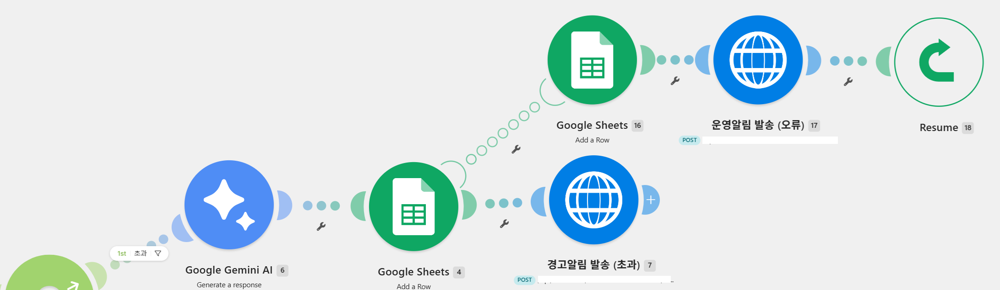
> **캡처 24 · 에러 핸들러 경로 구조.** 경로 1의 Google Sheets 기록 모듈에서 **점선**으로 분기되어 `실패보관` 적재 → `#운영알림` 발송 → `Resume`으로 이어진다. 점선은 Make에서 에러 처리 경로를 나타내는 표기이며, 정상 실행에서는 이 경로가 타지 않는다.

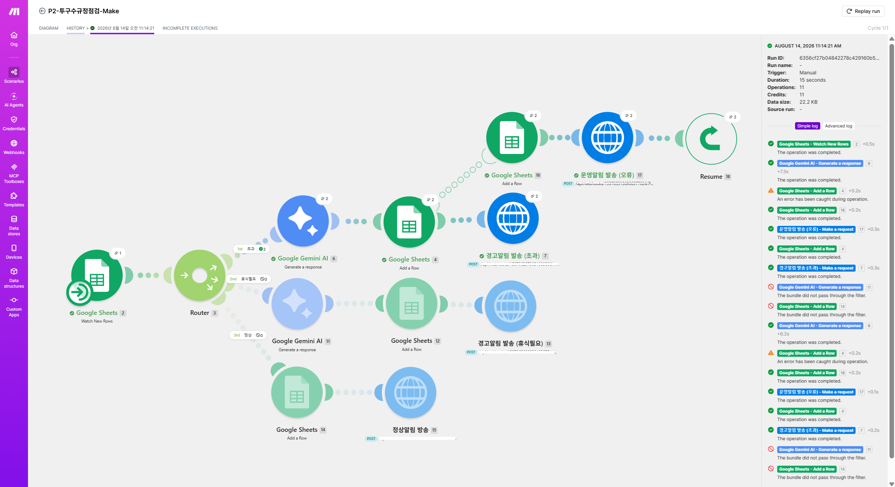
> **캡처 25 · 고의 실패 실행 로그 (2026-08-14 11:14:21, 2건 · 11 operations).** 실행 로그에 `Google Sheets - Add a Row 4` 항목이 경고 아이콘과 함께 **`An error has been caught during operation`**으로 기록되었다. 즉 오류가 발생했으나 핸들러가 포착했다는 뜻이다. 직후 `Add a Row 16`(실패보관)과 `운영알림 발송 (오류) 17`이 연속 성공하고, `Resume`으로 모듈 4가 성공 처리되어 후속 `경고알림 발송 (초과) 7`까지 진행되었다. **미실행 경로는 `The bundle did not pass through the filter`로 차단**되어 조건 분기가 정상 동작했음도 같은 로그에서 확인된다. 동일 사이클이 2회 반복 기록되어 있다.

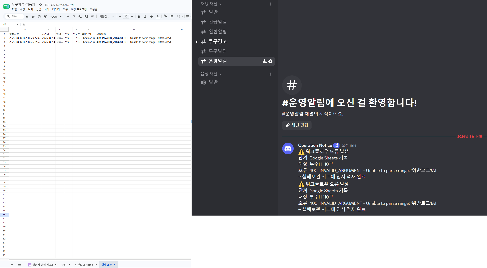
> **캡처 26 · 대체 적재 및 관리자 알림 결과.** 왼쪽 `실패보관` 시트에 2건이 적재되었고, A~E 컬럼(`발생시각`·`경기일`·`청룡고`·`투수H`·`110`)이 밀림 없이 채워졌다. **G열 오류내용에 실제 API 오류 문구**(`400: INVALID_ARGUMENT - Unable to parse range: '위반로그'!A1`)가 기록되어 원인 추적이 가능하다. 하단 시트 탭이 `위반로그_temp`인 것은 고의 실패를 위해 대상 시트명을 변경한 상태이기 때문이다. 오른쪽 `#운영알림` Discord 채널에는 동일 2건이 실패단계·대상·오류내용과 함께 도착했으며, 변수가 빈 값 없이 치환되었다.

**설계 효과**

핸들러가 없다면 이 실행은 **경로 1의 데이터가 어디에도 남지 않고 사라진 채 시나리오가 중단**되었을 것이다. 후속 `#투구경고` 알림도 발송되지 않아, 투구수 초과 선수에 대한 경고가 누락된다. 대상이 미성년 선수의 안전 관련 규정이라는 점을 감안하면 이 누락은 단순 데이터 손실보다 무겁다.

에러 핸들러 도입으로 확보한 것은 세 가지다. **① 데이터 보존** — 실패한 건이 `실패보관` 시트에 남아 수동 복구가 가능하다. **② 실패 가시화** — 관리자가 로그를 열어보지 않아도 Discord로 즉시 인지한다. **③ 흐름 지속** — `Resume` 덕분에 기록 실패가 알림 발송까지 막지 않는다.

---

## 4. 설계 원칙 — 모듈화와 재사용

두 프로젝트를 진행하며 **같은 구조를 세 번 만들었다.** 프로젝트 1에서 동일 워크플로우를 Make와 n8n으로 각각, 프로젝트 2에서 3개 경로를 복제로. 그 과정에서 확인한 재사용 원칙을 정리한다.

### 4.1 워크플로우를 구성하는 3계층

노코드 워크플로우는 아래 세 층으로 분해된다. **계층별로 변경 빈도와 이식 난이도가 다르므로, 분리해 두면 재사용 단위가 명확해진다.**

| 계층 | 내용 | 변경 빈도 | 도구 간 이식성 |
|---|---|---|---|
| **① 구조** | Trigger → 분기 → Action의 연결 관계 | 낮음 | 높음 (개념이 도구 공통) |
| **② 판정 규칙** | 분기 조건값 (`urgent`, `105`, `45`) | 중간 (규정·정책 변경 시) | 높음 (값만 옮기면 됨) |
| **③ 연동 설정** | Credential, 시트 ID, Webhook URL, 필드 매핑 | 낮음 | **낮음 (도구마다 재작업)** |

프로젝트 1에서 Make → n8n 이식이 가능했던 이유는 ①과 ②가 도구에 종속되지 않았기 때문이고, 70분이 걸린 이유는 ③을 처음부터 다시 만들어야 했기 때문이다. **재사용 설계의 핵심은 ③에 대한 의존을 ①·②에서 걷어내는 것이다.**

### 4.2 실제로 적용한 재사용 패턴

**① 구조 명세를 먼저 확정하고 이식했다**

프로젝트 1은 구현 전에 Trigger·분기 조건·Action 구성을 문서로 확정한 뒤(§1.1) 두 도구에 각각 옮겼다. 도구를 켜고 즉흥적으로 만들었다면 두 결과물의 구조가 달라져 비교 자체가 성립하지 않았을 것이다.

**② 판정 규칙을 조건값으로 외부화했다**

프로젝트 2의 Router 조건에는 `105`, `45`라는 KBSA 규정 수치가 그대로 들어 있다. 규정이 개정되면 **모듈을 다시 만들 필요 없이 Filter의 숫자만 바꾸면 된다.** 반대로 판정 로직을 시트 수식이나 코드에 묻어두면 수정 지점을 찾는 것부터 일이 된다.

**③ 반복되는 지식은 한 곳에 모았다**

AI 프롬프트에서 KBSA 규정표는 **System Instructions**에, 경로별 지시문은 **Messages**에 배치했다. 두 경로가 같은 규정을 공유하되 요청만 달라지는 구조다. 규정을 각 경로의 프롬프트에 복붙했다면 개정 시 두 곳을 고쳐야 하고, 한쪽을 빠뜨리면 경로마다 다른 기준이 적용된다.

**④ 경로 단위로 복제했다**

프로젝트 2의 경로 2·3은 경로 1의 모듈 세트(Gemini → Sheets → HTTP)를 복제해 만들었다. 변경한 것은 **시트 이름, Webhook URL, 판정 고정값, 프롬프트 지시문 4개뿐**이다. 이 4개가 곧 "경로 간 차이의 전부"이며, 나머지는 공통 자산이다.

### 4.3 복제가 실패하는 지점 — 실측 사례

**재사용에는 대가가 따른다.** 복제 과정에서 두 종류의 사고를 겪었다.

| 사고 | 원인 | 증상 | 대응 |
|---|---|---|---|
| **참조 단절** | 복제된 모듈이 **원본 경로의 모듈**을 계속 참조 | `references inaccessible module` 경고 | 변수를 삭제하고 같은 경로 모듈에서 재삽입 |
| **설정 누락** | 복제 후 바꿔야 할 4개 항목 중 일부를 놓침 | 오류 없이 **엉뚱한 시트·채널로 전송** | 복제 직후 변경 항목 체크리스트로 전수 확인 |

두 번째가 더 위험하다. **오류가 나지 않고 조용히 잘못 동작**하기 때문이다. 프로젝트 1에서도 같은 유형(복붙 변수가 빈 값으로 실행)을 겪었다(§1.5-7).

**여기서 도출한 규칙:** 모듈을 복제하면 **반드시 변경 항목 목록을 먼저 적고, 복제 후 그 목록을 대조**한다. 노코드 도구는 컴파일 오류로 실수를 잡아주지 않으므로, 이 대조가 유일한 안전장치다.

### 4.4 규모가 커질 때의 분리 전략

이번 워크플로우는 모듈 8~9개 규모라 단일 시나리오로 충분했다. 복잡도가 올라가면 아래 순서로 분리하는 것이 타당하다.

| 신호 | 분리 방법 |
|---|---|
| 경로별 Action이 5개를 넘어감 | 경로를 **별도 시나리오**로 분리하고, 메인은 판정과 위임만 담당 |
| 같은 Action 세트가 여러 시나리오에 반복됨 | 해당 세트를 독립 시나리오로 만들고 **Webhook으로 호출**해 공용 컴포넌트화 |
| Make 5분 실행시간 제한에 근접 | 처리 단위를 쪼개 여러 실행으로 분산 |
| 활성 시나리오 2개 제한에 걸림 | 유사 업무를 한 시나리오로 통합하거나 셀프호스팅으로 전환 |

**Webhook을 이용한 시나리오 호출**이 노코드 환경에서 함수 호출에 가장 가까운 수단이다. 프로젝트 1에서 Webhook Trigger를 다뤄본 경험이 그대로 활용된다. 다만 호출마다 실행량을 소비하므로, 무료 플랜에서는 분리와 비용이 상충한다.

### 4.5 코드 기반 전환이 필요해지는 지점

노코드로 감당하기 어려워지는 신호를 정리하면 다음과 같다.

| 신호 | 노코드의 한계 | 전환 판단 |
|---|---|---|
| 조건 분기가 10개를 넘어감 | 캔버스에서 흐름 파악이 불가능해짐 | 코드의 조건문·테이블 조회로 이관 |
| 동일 로직이 3개 이상 시나리오에 중복 | 노코드에는 공용 함수 개념이 없음 | 공통 로직을 API로 분리 |
| 배열 순회·집계가 주 작업이 됨 | 실행량·실행시간 제한에 직결 | 데이터 처리는 코드나 DB로 |
| 변경 이력 관리가 필요해짐 | 시나리오 diff 비교가 어려움 | 코드로 옮겨 버전 관리 |

이번 프로젝트에서 **통계 집계를 자동화 도구가 아닌 스프레드시트에 맡긴 판단**(§2.3)이 이 원칙의 축소판이다. 자동화 도구는 **이벤트에 반응하는 일**에 강하고, 집계·연산은 다른 도구가 낫다. 도구를 늘리기 전에 **각 도구가 잘하는 일에 맞게 책임을 나누는 것**이 먼저다.

---

## 5. 보안 처리

미션 제약에 따라 제출물에서 민감정보를 제거했다.

| 대상 | 처리 |
|---|---|
| Make Webhook URL | 본문·캡처 모두에 미기재 (프로젝트 1 Trigger 주소) |
| Discord Webhook URL | 캡처 전수 점검 완료 (노드 라벨 하단 노출 포함) |
| Google 계정 / OAuth 클라이언트 ID·시크릿 | 문서·캡처에 미기재 |
| Google Gemini API 키 | Make Credential 저장소에만 보관, 입력 화면에서 마스킹 표시됨을 확인 |
| n8n 로컬 계정 정보 | 문서에 미기재 |
| 실명 / 조직 식별자 | Discord 서버명, 브라우저 프로필, GCP 콘솔 계정 표시 영역 제외 |

**테스트 데이터의 가상화**

| 프로젝트 | 사용한 가상 데이터 |
|---|---|
| 프로젝트 1 | `T-1001`~`T-2006`, `고객A`~`고객F` |
| 프로젝트 2 | `투수A`~`투수F`, `청룡고`·`백호고`·`주작고`·`현무고` |

**프로젝트 2의 개인정보 민감도** — 대상이 고교 선수, 즉 미성년자이므로 일반적인 테스트 데이터보다 높은 기준을 적용했다. 선수명·팀명 전부를 가상값으로 대체했고, AI 서비스에 전달되는 프롬프트에도 실제 개인정보가 포함되지 않도록 구성했다.

**작업 종료 후 조치 예정** — Make Webhook 재발급(프로젝트 1에서 사용한 URL 폐기), Discord Webhook 전량 재발급(`#긴급알림`·`#일반알림`·`#투구경고`·`#투구알림`·`#운영알림`), 사용하지 않는 시나리오 정리.

**에러 핸들러 관련 추가 점검** — 보너스 2에서 신설한 `실패보관` 시트와 `#운영알림` 채널에도 동일 기준을 적용했다. 실패보관 시트에 적재되는 값은 폼 응답의 가상 데이터와 API 오류 메시지뿐이며, 자격증명·URL은 포함되지 않는다. `#운영알림` 발송 모듈의 Webhook URL은 캡처 시 모듈 이름 변경으로 라벨 노출을 차단했다.

## 6. 작업 로그

### 2026-08-05 (1일차)

**결정**
- **미션 구조 재확인** — 프로젝트는 2개지만 구현할 워크플로우는 3개(프로젝트 1에서 동일 구조 × 도구 2개 + 프로젝트 2에서 1개)임을 확인. 공통 요구사항(Trigger 1+/Action 2+/조건 분기 1+)이 두 프로젝트 모두에 적용되므로 프로젝트 2에도 조건 분기가 필수.
- **README를 채점 대상 정본으로 확정** — 평가 도구가 README만 분석하므로 보고서·설계문서를 별도 파일로 분리하지 않고 전문을 README 본문에 작성하기로 결정.
- **프로젝트 1 주제 확정: Webhook 문의 접수 분류** — 트리거를 임의로 발생시킬 수 있고, 분기가 업무 논리에서 자연스럽게 나오며, 무료 커넥터만으로 구성 가능하다는 세 조건을 충족.
- **도구 조합 확정: Make + n8n(셀프호스팅)** — 둘 다 조건 분기를 무료로 사용 가능하고, 노드 기반 대 노드 기반이라 구조 이식이 쉬우면서 UX 철학 차이가 뚜렷해 비교 서술이 풍부해진다고 판단.
- **시간 측정 규칙 수립** — 두 도구에서 공통 반복되는 구간만 측정. 준비물 생성·요금제 조사는 제외.

**작업**
- Make 계정 생성, Free 플랜 한도 확인 및 캡처 (초기 진입 9분)
- Google Sheets `문의접수-자동화` 생성 (시트 2개, 헤더 7컬럼)
- Discord 서버 및 `#긴급알림`·`#일반알림` 채널·Webhook 생성
- Make 시나리오 `P1-문의접수분류-Make` 구현 (22:39~23:33, **54분**)
- 분기 테스트 6건 실행 (23:33~23:59, **26분**)
- Make 캡처 8장 확보

**이슈**
- PowerShell 요청 전송에서 3회 연속 실패. JSON 닫는 중괄호 누락 → Webhook 미대기 상태 → 붙여넣기 시 `>>` 연속입력 상태 순. 약 10분 소요.
- **Make fallback route 지정 UI를 찾지 못함.** 경로 B에 `Not equal to` 필터를 거는 방식으로 우회. → §1.5-6 근거
- **변수 매핑 무음 실패.** `{{ticket_id}}` 문자열 붙여넣기가 변수 태그로 변환되어 정상으로 보였으나 실행 시 값이 전부 비어 있었음. 오류·경고 없이 "성공"으로 표시되어 Discord 알림을 확인하기 전까지 발견 불가. 4개 모듈 전부 재작업. → §1.5-7 근거
- **Webhook 큐 적재 동작 확인.** 대기 상태가 아닐 때 보낸 요청이 큐에 쌓였다가 이후 `Run once` 시 소진되어 T-1002가 3회 중복 기록됨. → §1.5-9 근거
- Make 실행 로그가 `Run once` 실행분도 History에 정상 기록됨을 확인. 단 Trigger 항목이 `Manual`로 표시되므로 프로젝트 2의 자동 실행 요건에는 부적합.

**다음**
- n8n 환경 구축 및 동일 구조 이식

---

### 2026-08-12 (2일차)

**결정**
- **프로젝트 2에서 도구를 자유롭게 선택하기로 함.** 미션은 "도구 1개 선정 + 이유"만 요구하므로 프로젝트 1의 우세 도구를 그대로 쓸 필요가 없다. 업무 특성에 맞는 선택을 프로젝트 1의 측정 데이터로 근거화하는 것이 더 나은 답안이라 판단.
- **n8n Production URL 대신 Test URL 방식으로 프로젝트 1 테스트 완수.** 프로젝트 1은 자동 실행이 요구사항이 아니고, Make도 `Run once`로 진행해 조건이 대등하므로 검증에 지장 없음.

**작업**
- Make 잔여 캡처 정리 (시트 중복 행 제거, Discord 채널별 캡처)
- Docker Desktop + WSL2 설치, n8n 2.34.4 구동 (16:20~16:33, **초기 진입 13분**)
- n8n 워크플로우 `P1-문의접수분류-n8n` 구현 (16:44~18:39, 중단 45분 제외 **70분**)
- Google Sheets OAuth 인증 구성 (17:00~17:18, **18분**)
- 분기 테스트 6건 실행 완료
- n8n 캡처 7장 확보, 전체 캡처 마스킹 점검 완료
- README 프로젝트 1 전문 작성

**이슈**
- Docker Desktop 설치 후 `WSL not installed` 오류. `wsl --install` + 재부팅 필요. → 초기 진입 시간에 포함
- **Google Sheets 인증에 18분 소요.** GCP 프로젝트 생성 → Sheets/Drive API 활성화 → OAuth 동의 화면 → 테스트 사용자 등록 → 클라이언트 ID 발급 → 리디렉션 URI 등록. Make는 동일 작업이 1~2분. → §1.5-3 근거
- 브라우저 기본 계정이 다른 계정으로 잡혀 GCP 콘솔 접근이 차단됨. `?authuser=` 인덱스 지정으로 우회. 환경 요인이나 셀프호스팅이 사용자 환경에 더 많이 노출되는 사례.
- **페이로드가 `body`에 중첩되는 구조 확인.** `$json.priority`가 아니라 `$json.body.priority`로 참조해야 함. INPUT 패널 드래그 시 경로 자동 계산됨. → §1.5-7 근거
- **컨테이너 종료로 워크플로우 전체 정지.** 재실행 필요. → §1.5-9 근거
- **Production URL이 게시 후에도 404 반환.** Test URL 방식으로 전환해 완수.
- 작업 중 Webhook URL 식별자를 잘못 입력해 404가 반복됨. 약 10분 소모. **도구 특성이 아니므로 비교 해석에서 제외 명시** (§1.5).
- n8n 오류 메시지가 원인뿐 아니라 해결 방법과 주의사항까지 포함함을 확인. → §1.5-8 근거
- **결과 동등성 확인.** `priority` 필드가 없는 T-1006(Make)·T-2006(n8n)이 양쪽 모두 일반 경로로 처리됨. 구현 방식이 달라도(Filter `Not equal to` vs IF false) 결과는 동일. → §1.4-C

**다음**
- 프로젝트 2 주제 확정 및 설계
- 프로젝트 2 구현 (Trigger 자동 실행 검증 필수)
- 보너스 과제 검토
- Make Webhook 재발급 및 최종 보안 점검

---

### 2026-08-13 (3일차)

**결정**

- **프로젝트 2 주제 확정: 고교야구 투구수 규정 자동 점검** — 분기 기준이 KBSA 규정으로 명문화되어 있어 "억지 IF"가 아니고, 미성년 선수 안전과 직결되어 자동화 명분이 뚜렷하며, Google Form으로 트리거를 임의 발생시킬 수 있다는 세 조건을 충족.
- **도구 선정: Make** — 프로젝트 1 실측 근거 3가지. ① n8n 셀프호스팅은 컨테이너 종료 시 워크플로우가 정지해 자동 실행 지속성을 보장할 수 없음(§1.5-9에서 실제 경험) ② 분기 3개는 Router가 유리(§1.6 결론의 실검증) ③ Google 인증 비용이 이미 지불된 상태.
- **분기 구조를 3경로로 단순화** — KBSA 규정은 휴식일 구간이 5개지만 경로를 6개로 만들면 테스트·복제 부담이 커짐. 초과/휴식필요/정상 3경로로 묶고 구체적 휴식일수는 AI 문구 생성 단계에서 처리하도록 배치.
- **판정 로직을 시트 수식에서 Make Router로 이관** — 아래 이슈 참조. 결과적으로 규정 숫자(105, 45)가 Router 조건에 직접 노출되어 조건 분기 설계가 더 명확해짐.
- **AI 범위를 문구 생성으로 한정** — 판정까지 AI에 맡기면 응답이 매번 달라져 안전 규정 판단에 부적합. 판정은 규칙, 서술은 AI로 역할 분리.
- **AI 서비스로 Google Gemini 선정** — OpenAI는 2026년 기준 영구 무료 티어가 사실상 없고 선불 결제 필요. 무료 대안이 존재하므로 유료 결제를 정당화할 근거가 없다고 판단.
- **Router 조건을 배타적으로 설계** — 프로젝트 1에서 fallback route를 찾지 못해 우회했던 경험을 반영. 세 조건이 겹치지 않으므로 경로 순서가 바뀌어도 판정 결과가 불변.

**작업**

- Google Sheets(`투구기록-자동화`) 및 Google Form(`투구기록 제출`) 생성, 폼-시트 연결
- Discord `#투구경고`·`#투구알림` 채널 및 Webhook 생성
- Google Gemini API 키 발급 (AI Studio, 카드 등록 없이 무료 티어)
- Make 시나리오 `P2-투구수규정점검-Make` 구현 (경로별 단위 테스트 포함, 14:44~16:01 및 20:24~21:10)
- 자동 실행 검증: 21:10~21:12 폼 6건 제출 → 21:40:39 `Schedule` 자동 실행 확인 (~21:41)
- 프로젝트 2 캡처 7장 확보 및 마스킹 점검
- README 프로젝트 2·보너스 전문 작성

**이슈**

- **Google Forms 응답 시트에서 수식이 반복 파괴됨.** 각 행에 수식을 복사하면 폼이 새 행 삽입 시 덮어쓰고, ARRAYFORMULA로 바꾸면 폼이 해당 열에 값을 써서 `#REF!`(배열 결과가 데이터를 덮어쓸 수 없음)가 발생. 열 삭제 후 재입력을 반복했으나 폼 응답이 들어올 때마다 재발. → **판정 로직을 Make Router로 이관해 근본 해결.** 시트는 폼 원본 6개 열만 유지.
- 별도 시트에서 참조하는 방식도 검토했으나, **수식으로 생성된 행을 Make `Watch New Rows`가 신규 행으로 감지하지 못할 위험**이 있어 채택하지 않음. 자동 실행이 필수 요구사항이라 검증되지 않은 방식을 쓸 수 없다고 판단.
- 날짜 계산 결과가 일련번호로 표시되는 문제 → `TEXT(..., "YYYY-MM-DD")`로 문자열 변환해 해결. 다만 판정 로직 이관으로 최종 설계에서는 불필요해짐.
- Make Gemini 모듈명이 문서·안내와 상이(`Create a Completion`이 아닌 `Generate a Response`). 설정 구조도 Messages → Item → Parts → Message Type/Text로 중첩되어 있어 탐색에 시간 소요.
- **모듈 순서 문제.** Sheets를 Gemini보다 먼저 배치해 안내문구 칸에 AI 결과를 참조할 수 없었음. Router에서 나가는 연결선은 필터 설정 전용이라 삭제가 불가능해 재배치에 어려움. → 모듈 재구성으로 Gemini → Sheets → HTTP 순서 확보.
- **복제 모듈의 참조 오류.** 경로 2용으로 모듈을 복제하자 `references inaccessible module` 경고 발생. 복제본이 다른 경로의 Gemini 모듈을 참조하고 있었음. → 변수를 삭제하고 같은 경로의 모듈에서 재삽입.
- **자동 실행이 데이터를 처리하지 않는 문제.** 시나리오 활성화 후 `Schedule` 실행은 발생했으나 계속 `1 operations`(신규 행 0건). 원인은 Trigger의 시작 지점 — 초기에 `Choose manually`로 특정 행을 지정한 뒤 시트 행을 여러 차례 삭제·재입력하면서 Make가 기억하는 행 번호가 어긋남. → 시나리오 비활성화 후 Trigger 시작 지점을 `All`로 재설정, 재활성화하여 해결.
- **Make 활성 시나리오 2개 제한이 실제 제약으로 작동.** 프로젝트 2 자동 실행 검증을 위해 프로젝트 1 시나리오를 비활성화해야 했음. → §2.7에 기록.
- Google AI Studio UI 개편으로 `Get API key` 메뉴 위치가 변경됨(좌측 하단 열쇠 아이콘 또는 `/apikey` 직접 접근).

**결과 확인**

- 세 경로 각 2건씩 총 6건 자동 처리 (`Schedule` 트리거, 17 operations)
- AI가 구간별로 다른 안내 생성: 초과분 5구/15구, 휴식일 4일/1일, 다음 등판 가능일 산출
- 폼 제출(21:12)과 자동 실행(21:40:39) 사이 28분 간격 — 폴링 주기에 따른 지연이며, 사람의 개입 없이 실행되었음을 뒷받침

**다음**

- 보너스 2(실패 알림·재시도) 검토 — 선택 과제
- 캡처 폴더 구조 정리 및 이미지 상대경로 최종 확인
- Make·Discord Webhook 재발급, 제출 전 보안 전수 점검

---

### 2026-08-14 (4일차)

**결정**

- **보너스 2를 수행하기로 확정** — 선택 과제이나 사전평가에서 미구현이 지적된 항목이고, 프로젝트 2가 미성년 선수 안전 규정을 다루는 주제라 실패 시 데이터 유실이 단순 손실 이상의 의미를 갖는다고 판단.
- **적용 대상을 경로 1(초과)의 Sheets 모듈로 한정** — 세 경로 전부에 핸들러를 붙이면 모듈이 9개 늘어 캔버스 가독성이 떨어지고 실행량도 증가한다. 가장 중요도가 높은 경로 하나에 적용해 설계 타당성을 입증하는 편이 낫다고 판단.
- **`Retry`가 아니라 `Resume`을 선택** — 설정성 오류는 재시도해도 동일하게 실패하므로 대체 경로가 타당. 검증에서 실제 오류가 `400: INVALID_ARGUMENT`(대상 부재)로 확인되어 판단이 뒷받침됨. → §3
- **고의 실패를 Make 설정이 아닌 Google Sheets 탭 이름 변경으로 유발** — 모듈 설정 변조 방식이 컬럼 매핑을 파괴한다는 사실을 확인한 뒤 전환(아래 이슈). 시나리오를 전혀 건드리지 않으므로 원복도 탭 이름 하나만 되돌리면 된다.
- **`p2-08`을 전체 캔버스가 아닌 에러 핸들러 구간 확대 컷으로 촬영** — 전체 캔버스는 `p2-01`과 사실상 동일한 이미지가 되어 증거로서 중복. 구간을 확대해 §2.4(구현 화면)와 §3(핸들러 구조)의 역할을 실제로 분리.

**작업**

- 에러 핸들러 HTTP 모듈 설정 완료 (Method `POST`, Body content type `application/json`, Parse response `No`)
- `Resume` 지시자 배치 — 대체 출력값은 공란 처리
- HTTP 모듈 4개 이름 변경 (`경고알림 발송 (초과)`·`(휴식필요)`·`정상알림 방송`·`운영알림 발송 (오류)`)
- 고의 실패 유발 및 검증 실행 (11:14:21, 2건 · 11 operations)
- 원복 후 정상 실행 재검증 — 핸들러 미발동 확인
- 캡처 3장 확보 (`p2-08`·`p2-09`·`p2-10`) → 총 26장
- README §0·§3·§5 갱신

**이슈**

- **에러 핸들러 모듈의 Connection·Drive 미승계.** 복제로 만든 `실패보관` Sheets 모듈에서 `Connection: Value must not be empty` / `Drive: Value must not be empty` 경고 발생. 캔버스의 빨간 배지로만 드러나 설정창을 열기 전까지 인지하지 못함. → §4.3의 "설정 누락" 유형이 에러 핸들러 경로에서도 동일하게 재현된 사례.
- **Sheet Name 변조 시 컬럼 매핑 전체 소실.** 고의 실패를 위해 Sheet Name을 존재하지 않는 값(`위반로그XX`)으로 바꾸자 `Unable to parse range` 오류와 함께 `Values in columns` 섹션이 사라졌고, 저장 후 A~G 매핑 7칸이 전부 비었음. Make가 시트 헤더를 읽어 매핑 UI를 구성하는 구조이기 때문. → 원래 시트명으로 되돌려 매핑 복구.
- **Map 토글이 Search Method에 종속됨.** `Search by path` 모드에서는 Sheet Name이 선택형이라 Map 토글 자체가 없다. `Select from all`로 바꿔야 나타나며, 이때 Spreadsheet 지정 방식도 이름에서 ID 기반으로 함께 바뀐다. 설정 항목이 서로 독립적이지 않다는 점이 노코드 도구의 특성.
- **Spreadsheet Name도 선택형이라 직접 입력 불가.** ID 변조 방식 역시 봉쇄됨. 세 차례 우회를 시도한 끝에 **Make 설정을 건드리지 않고 Google Sheets 탭 이름을 변경하는 방식**으로 해결. 시나리오 무결성을 유지한 채 실패를 유발할 수 있어 원복 위험도 가장 낮다.
- **모듈 이름 변경이 히스토리 화면의 Webhook 경로 표시까지는 가리지 못함.** 캔버스에서는 이름으로 대체되지만 실행 히스토리에서는 `POST /api/webhooks/...`가 별도 줄로 표시된다. → `p2-09`는 캔버스가 아닌 실행 로그 영역 위주로 촬영해 회피.
- 실행 시 미처리 행 1건이 함께 잡혀 2건이 처리됨. 오류 처리가 2회 재현된 셈이라 증거로서는 오히려 유리해 그대로 채택하고 캡션에 사실대로 기재.

**결과 확인**

- 로그에 `An error has been caught during operation` 기록 후 핸들러 2개 모듈 연속 성공, `Resume`으로 후속 Action까지 진행
- `실패보관` 시트 2건 적재, G열에 실제 API 오류 문구 기록
- `#운영알림` Discord 2건 도착, 변수 치환 정상
- 원복 후 정상 실행에서 핸들러 미발동 확인

**다음**

- 폴더명 오타 수정 (`Project1-tool-comparision` → `project1-tool-comparison`), `project2-custom-automation` 생성
- README 이미지 상대경로 26장 전수 확인 (VS Code 미리보기)
- 캡처 최종 마스킹 점검
- GitHub 업로드 및 렌더링 확인
- 제출 후 Webhook 전량 재발급
